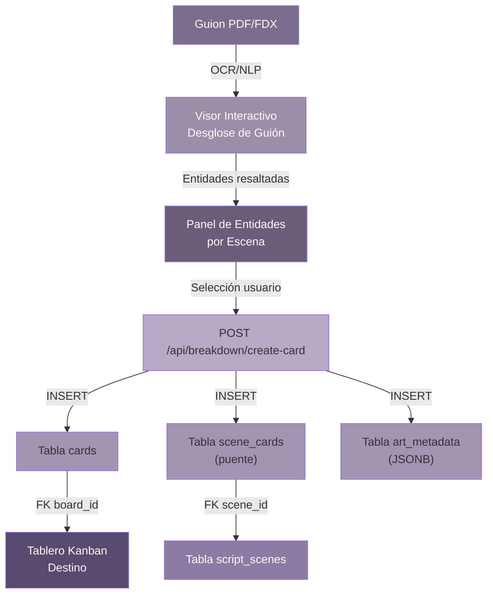
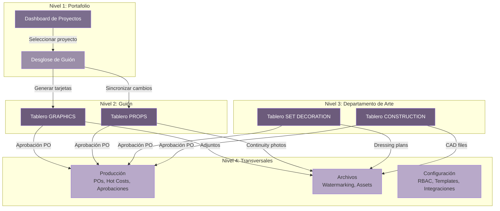
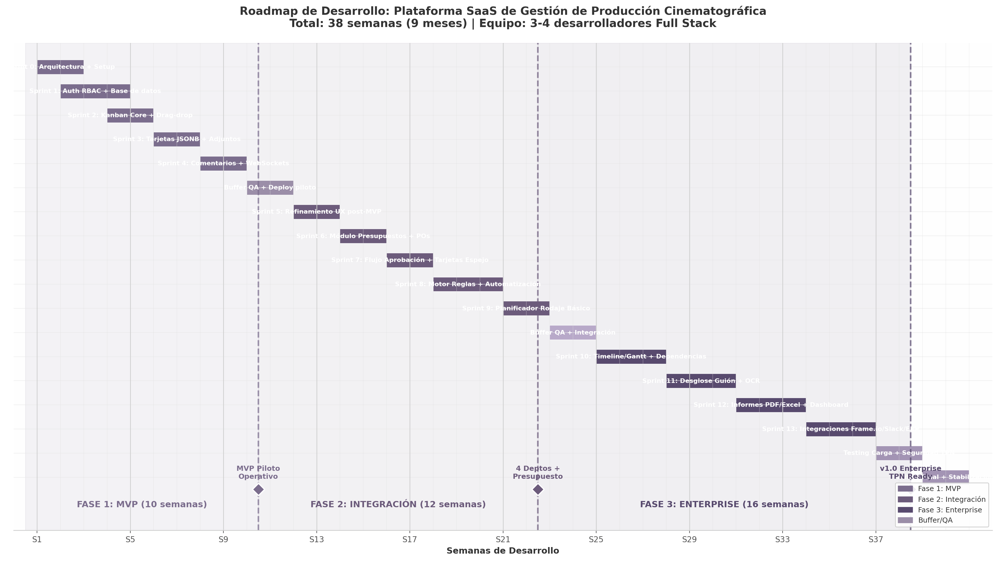

# Plataforma SaaS de Gestion de Produccion Cinematografica
## Arquitectura Tecnica y Roadmap de Desarrollo para el Departamento de Arte

---

**Documento Tecnico | Version 1.0 | Abril 2026**

**Clasificacion:** Documento de Arquitectura de Software y Planificacion de Proyecto

**Alcance:** Plataforma web colaborativa especializada en la gestion del Departamento de Arte (Graphics, Props, Set Decoration, Construction) y su interaccion con el Departamento de Produccion en rodajes de cine, publicidad y series de alto nivel (Estandares Netflix/Disney/HBO).

---

## Resumen Ejecutivo

Este documento presenta la vision arquitectonica completa y el plan de desarrollo secuencial para una plataforma SaaS vertical que transforma la gestion del Departamento de Arte en producciones cinematograficas de alto presupuesto. Inspirada en la usabilidad visual de Trello pero profundamente especializada en el dominio del entretenimiento, la solucion propuesta no es un clon generico de tableros Kanban: es un sistema de orquestacion que conecta la creatividad de cuatro subdepartamentos — Graphics, Props, Set Decoration y Construction — con el rigor financiero y logistico de Produccion.

El analisis de referencia de Trello.com revela cuatro pilares arquitectonicos transferibles: una jerarquia visual de Workspace > Board > List > Card que reduce la carga cognitiva del usuario; un sistema de Power-Ups que permite extender funcionalidad sin complicar la interfaz base; un motor de automatizacion (Butler) que elimina tareas repetitivas mediante reglas declarativas; y un reverso de tarjeta rico que centraliza toda la informacion contextual de una tarea. La plataforma propiedad adapta estos pilares al lenguaje especifico del cine: las tarjetas llevan metadatos cinematograficos (referencias de escena, estado de continuidad, tipo de prop) y los tableros reflejan flujos de trabajo reales como "Necesidad Detectada > Busqueda > Adquirido > En Taller > En Set > Devuelto" para Props, o "Planos Recibidos > Despiece > En Construccion > Acabados > Montaje" para Construction.

El Bloque 1 de este documento detalla la vision arquitectonica y funcional: un modelo de datos hibrido PostgreSQL+JSONB que mantiene la integridad transaccional para presupuestos mientras permite la flexibilidad de campos dinamicos por subdepartamento; una arquitectura de navegacion de cuatro niveles que separa Desglose de Guion, Departamento de Arte, Produccion y Archivos; y cuatro vistas Kanban especializadas con columnas, campos visibles y codigos de color especificos para Graphics, Props, Set Decoration y Construction. El modelo incluye vinculacion bidireccional entre escenas de guion y tarjetas de recurso, flujo de aprobacion presupuestaria con tarjetas espejo entre Arte y Produccion, y un motor de automatizacion con reglas de dominio cinematografico.

El Bloque 2 presenta un roadmap realista de tres fases y 38 semanas de desarrollo activo con un equipo de 3-4 desarrolladores Full Stack. La Fase 1 (MVP, 10 semanas) valida la mecanica Kanban con un subdepartamento piloto. La Fase 2 (Integracion, 12 semanas) conecta Arte con Produccion mediante presupuestos digitales y automatizaciones. La Fase 3 (Enterprise, 16 semanas) anade Gantt con dependencias, OCR para desglose de guion, generacion de informes PDF/Excel, e integraciones con Frame.io, AutoCAD, Adobe CC, Slack/Teams y ERP. Cada fase define stack tecnologico justificado, estimaciones con buffer para complejidad de dominio, y metricas de exito medibles: DAU, tiempo de creacion de tarjeta, tasa de aprobacion de gastos, y reduccion de incidencias de continuidad.

La propuesta de valor final no es meramente organizar tareas: es orquestar la construccion del mundo visual de una pelicula, desde el primer boceto grafico hasta el ultimo claquetazo, eliminando los silos de informacion y los errores de continuidad que plaguan las producciones gestionadas con hojas de calculo y correo electronico.

---

## 1. Bloque 1: Visión Arquitectónica y Funcional

### 1.1 Personalización de la Mecánica Trello para el Nicho Cinematográfico

#### 1.1.1 Análisis de la arquitectura visual de Trello y su afinidad con equipos creativos

La decisión arquitectónica de basar la interfaz de la plataforma en la mecánica Trello no es caprichosa: responde a una convergencia natural entre la semiótica del tablero Kanban y la lógica operativa de un rodaje cinematográfico. Trello, propiedad de Atlassian, organiza el trabajo en una jerarquía visual de tres niveles —Workspaces > Boards > Lists > Cards— que ha demostrado ser absorbida por equipos creativos con una curva de aprendizaje prácticamente horizontal. El 81% de los clientes de Trello elige la plataforma por su facilidad de uso, y el 75% de las organizaciones reporta valor dentro de los primeros 30 días ^1^. Estos números son críticos cuando se considera que una producción cinematográfica reúne a cientos de freelancers —carpinteros, pintores scenic, attrezzisti, set dressers— que no pueden dedicar horas a capacitarse en software complejo entre un contrato y otro.

La arquitectura visual de Trello se sostiene sobre cuatro pilares directamente transferibles al entorno de producción. El primero es la **simplicidad visual**: tableros con fondos personalizables, listas verticales de ~272px de ancho con fondo `#EBECF0`, y tarjetas blancas con sombras sutiles (`0 1px 0 rgba(9, 30, 66, 0.25)`) que funcionan como "super post-its digitales" ^1^. El segundo pilar es la **flexibilidad estructural**: el usuario define sus propios flujos de trabajo mediante la disposición horizontal de listas y la movilidad de tarjetas vía drag-and-drop, lo que permite reconfigurar pipelines en segundos cuando el primer assistant director (1st AD) reordena el stripboard a mitad de jornada. El tercer pilar es la **extensibilidad vía Power-Ups**: un marketplace de más de 200 integraciones que transforma tableros básicos en hubs de trabajo especializados ^1^. El cuarto pilar es la **automatización no-code integrada**: Butler, un motor de reglas, botones y comandos programados que elimina tareas repetitivas sin exigir conocimientos de programación al Props Master o al Set Decorator ^1^.

Para el Departamento de Arte, esta arquitectura es particularmente apropiada porque replica mentalidades ya internalizadas. El Art Director piensa en listas como fases de un pipeline ("En Diseño", "En Aprobación", "En Fabricación"). El Props Master visualiza tarjetas como elementos de inventario que migran de estado. El Construction Coordinator ve columnas como hitos de progreso ("Planos", "Despiece", "En Construcción"). La metafora Kanban no necesita ser traducida; ya es el lenguaje nativo del departamento.

#### 1.1.2 Adaptación del paradigma Kanban a los cuatro subdepartamentos de Arte

El Departamento de Arte en una producción de alto nivel emplea cientos de personas subdivididas en áreas especializadas: Art Direction central, Sets, Construction y Property ^2^. Cada subdepartamento opera con flujos de trabajo distintos que, aunque interoperan, poseen ritmos, entregables y vocabularios propios. La adaptación del paradigma Kanban exige, por tanto, no un tablero genérico, sino cuatro configuraciones de lista predefinidas que reflejen los pipelines reales de cada unidad.

En **Graphics**, el flujo es esencialmente creativo-iterativo: un elemento gráfico (periódico, logo, señalética, contrato falso) nace como brief del guion o del Production Designer, pasa por fase de diseño en Adobe Illustrator/Photoshop, sufre rondas de revisión interna, requiere aprobación formal del director o del studio, y finalmente se entrega como archivo digital para playback en monitor o como físico impreso para set dressing ^2^ ^3^. Las listas del tablero Graphics deben reflejar este pipeline de aprobación artística: Briefing → En Diseño → Revisión → Aprobado → Archivo Entregado.

En **Props**, el flujo es logístico-inventarial. El Props Master realiza el script breakdown identificando cada prop, los clasifica como comprar/alquiler/fabricar/reutilizar ^4^, coordina con prop houses, realiza seguimiento de hero props (aquellos que interactúan directamente con actores), gestiona clearance legal para props con marca, y finalmente ejecuta el wrap con wrap box labels fotográficos ^5^ ^6^. El tablero Props requiere listas que tracquen esta odisea: Necesidad → Búsqueda → Adquirido → Taller → En Set → Devuelto.

En **Set Decoration**, el flujo combina curaduría estética con logística de montaje. El Set Decorator selecciona mobiliario y objetos de prop houses mediante planos de dressing (fotos de referencia que indican la colocación exacta de cada pieza), coordina al swing gang para montaje y desmontaje, y mantiene continuidad fotográfica entre tomas ^7^ ^8^. Las listas reflejan este ciclo: Concepto → Selección → Reservado → Montaje → Desmontaje.

En **Construction**, el flujo es industrial. El Construction Coordinator interpreta blueprints realizados en Vectorworks o AutoCAD ^9^ ^10^, ejecuta take-offs de materiales (lumber, hardware, steel, foam, plywood, paint) ^11^, programa la construcción hacia atrás desde las fechas de rodaje, y supervisa scenic painting, carpintería, yesería y acabados ^2^. Las listas del tablero Construction son: Planos → Despiece → En Construcción → Acabados → Montaje → Desmontado.

#### 1.1.3 Extensiones obligatorias que Trello genérico no cubre

A pesar de la afinidad estructural, Trello genérico presenta brechas que lo invalidan como solución directa para producciones cinematográficas de estudio. Estas extensiones no son mejoras cosméticas; son requisitos funcionales sin los cuales el departamento no puede operar dentro de los estándares Netflix/Disney/HBO.

La primera extensión crítica es el **sistema de metadatos de escena**. Trello ofrece Custom Fields (texto, número, dropdown, fecha, checkbox) con un límite de 50 campos por tablero ^1^. Una producción cinematográfica requiere metadatos nativos como `scene_number` (5, 12A, 12B), `int_ext` (INT/EXT), `day_night` (DAY/DUSK/NIGHT/DAWN), `script_page` (conteo de octavos), `location` (locación específica), y `characters_involved` ^1^. Estos campos no son decorativos: alimentan el stripboard, el call sheet y los reports de continuidad. En la plataforma propuesta, estos metadatos residen en campos JSONB estructurados dentro de la tabla `cards`, no como custom fields añadidos.

La segunda extensión es la **trazabilidad de continuidad**. El script supervisor, los set dressers y el props master necesitan vincular cada tarjeta a tomas específicas con fotos de referencia que permitan resetear el set exactamente entre tomas ^7^. Trello no tiene un modelo de continuidad nativo; adjuntar fotos a tarjetas es insuficiente cuando se necesita comparar visualmente el estado de un hero prop en la toma 3A versus la toma 5B, con anotaciones de tiempo de story (día 1 del guion vs. flashback).

La tercera extensión es el **flujo de aprobación presupuestaria**. En Trello, un movimiento de tarjeta de "En Proceso" a "Aprobado" es una acción de usuario sin control financiero. En producción, ese mismo movimiento implica que el Line Producer ha revisado el estimated cost, comparado contra el budget departamental (15-20% del below-the-line) ^12^, y emitido una aprobación formal que habilita el Purchase Order ^13^. La plataforma debe implementar un campo `approval_status` con estados (`draft`, `submitted`, `approved`, `rejected`) y controles RBAC (Role-Based Access Control) que impidan a un Set Decorator auto-aprobar gastos por encima del PO threshold (típicamente $500-$1,000 en mid-budget) ^13^.

La cuarta extensión es la **trazabilidad de props con cadena de custodia**. Después del incidente de Rust (2021), los protocolos de armas se han endurecido drásticamente: registros de cadena de custodia para cada arma y cada round, briefings de seguridad obligatorios, logs de verificación de "cold gun" antes de cada toma ^14^ ^15^. Un tablero de Props genérico no puede gestionar esta trazabilidad regulatoria sin un modelo de datos específico.

#### 1.1.4 Lecciones extraídas: simplicidad visual, Power-Ups y Butler

Tres lecciones arquitectónicas de Trello guían el diseño de la plataforma cinematográfica. La primera, **la simplicidad visual como estrategia de adopción**: Trello mantiene una interfaz deliberadamente reductiva donde la tarjeta frontal solo muestra título, etiquetas de color, fecha de vencimiento, checklist, comentarios, adjuntos y miembros asignados ^1^. La plataforma cinematográfica debe replicar esta restricción: en la vista Kanban de set, una tarjeta de Props no debe mostrar más que el nombre del prop, una miniatura fotográfica, el número de escena, y un indicador de hero prop. Los metadatos técnicos completos se reservan para el reverso de tarjeta extendido.

La segunda lección es el **modelo de Power-Ups como arquitectura de extensibilidad**. Trello permite habilitar funcionalidades adicionales por tablero sin contaminar la experiencia base: Calendar Power-Up, Map, Custom Fields, Card Repeater, Voting ^1^. La plataforma cinematográfica adopta este patrón modular: el visor CAD se habilita como extensión en tableros de Construction; el generador de call sheets como extensión en tableros de Producción; el watermarking dinámico como extensión global en todos los tableros. Este enfoque evita la sobrecarga cognitiva de presentar todas las funcionalidades a todos los usuarios.

La tercera lección es **Butler como motor de automatización**. Butler opera con cinco tipos de automatizaciones: Rules (trigger + action), Card Buttons, Board Buttons, Calendar Commands y Due Date Commands ^1^. La plataforma replica este motor con reglas cinematográficas nativas: "Cuando una tarjeta de Props se mueve a 'En Set', notificar al Script Supervisor y al 1st AD vía Slack"; "Cuando un hero prop cambia de escena, requerir aprobación del Props Master"; "Cada mañana a 6am, generar tarjeta 'Daily Production Report' en el tablero de Producción".

La siguiente tabla sintetiza la correspondencia arquitectónica entre los componentes de Trello y su adaptación al dominio cinematográfico:

| Componente Trello | Adaptación Cinematográfica | Función Específica en Producción | Prioridad Arquitectónica |
|---|---|---|---|
| Workspace | Production Company / Studio | Agrupa proyectos/películas bajo una misma entidad legal; permite billing centralizado | Alta |
| Board | Proyecto / Película / Temporada | Cada board = una producción con sus tableros de departamento, presupuesto y calendario | Alta |
| List | Pipeline de subdepartamento o secuencia | "Briefing → Diseño → Aprobado" para Graphics; "Planos → Despiece → Construcción" para Construction | Alta |
| Card | Prop / Set piece / Elemento gráfico / Set section | Unidad atómica de trabajo: un sofa, un hero prop, un blueprint, un scenic painting | Alta |
| Checklist item | Subtarea técnica o toma | "Slate → Mark → Action → Cut → Check gate" para cada toma; items de reset para continuidad | Media |
| Label (color) | Categoría cinematográfica | INT/EXT, DÍA/NOCHE, CON/SIN VFX, HERO PROP, PRIORIDAD RODAJE | Alta |
| Custom Field | Metadato técnico nativo | Scene number, page count, location, time of day, estimated cost, actual cost | Crítica |
| Card Cover | Thumbnail fotográfico del asset | Foto del prop, render del set, storyboard frame, texture sample | Media |
| Butler Rule | Automatización de producción | Notificaciones al 1st AD, generación de call sheets, alertas de budget | Alta |
| Power-Up | Extensión vertical | Visor CAD, watermarking, generador de POs, integración con Movie Magic | Media |
| Inbox | Captura desde set | Notas de voz del director, fotos de continuidad, mensajes de Slack del crew | Media |

La tabla anterior revela una correspondencia casi uno-a-uno entre la arquitectura de Trello y las necesidades de una producción cinematográfica, pero con una diferencia decisiva: mientras Trello es una plataforma horizontal donde cada equipo define su propio vocabulario, la plataforma cinematográfica impone un vocabulario vertical predefinido. Las etiquetas (labels) no son colores genéricos sino categorías cinematográficas estandarizadas (INT/EXT, DÍA/NOCHE). Los custom fields no son definidos por el usuario sino dictados por los metadatos del script breakdown. Las listas no son configurables libremente sino que siguen templates por subdepartamento que reflejan pipelines validados por décadas de práctica industrial. Esta es la decisión arquitectónica central: **no clonar Trello, sino replicar su mecánica mientras se sustituye su genericidad por especialización vertical**.

El impacto operativo de esta decisión es considerable. Un Props Master que llega a una nueva producción no necesita configurar su tablero desde cero: el tablero Props se genera con las listas correctas, los campos de metadatos predefinidos, y las automatizaciones cinematográficas activas. Esta estandarización reduce el tiempo de onboarding de horas a minutos, un factor crítico en una industria donde la rotación de personal es intrínseca al modelo de negocio de freelancing. La simplicidad visual de Trello se preserva, pero su vacío semántico se llena con el lenguaje específico del Departamento de Arte.


### 1.2 Modelo de Datos Extendido para los 4 Subdepartamentos

#### 1.2.1 Diseño de la tabla principal `cards` en PostgreSQL

La tabla `cards` constituye el núcleo del modelo de datos. A diferencia de un sistema de gestión de tareas genérico donde una tarjeta contiene título, descripción y estado, la tarjeta cinematográfica debe albergar metadatos heterogéneos que varían drásticamente según el subdepartamento: un prop necesita campos de sourcing y continuidad; un set piece necesita planos de dressing y coordenadas de colocación; un elemento gráfico necesita especificaciones de impresión y clearance; una sección constructiva necesita despiece de materiales y avance de obra. La estrategia arquitectónica para gestionar esta heterogeneidad sin fragmentar el modelo en múltiples tablas especializadas es el uso de **PostgreSQL JSONB**: un campo estructurado en formato JSON binario que permite almacenar esquemas semiestructurados con soporte nativo de indexación y consultas complejas.

El diseño de la tabla `cards` se presenta a continuación:

```sql
CREATE TABLE cards (
    id                  UUID PRIMARY KEY DEFAULT gen_random_uuid(),
    board_id            UUID NOT NULL REFERENCES boards(id) ON DELETE CASCADE,
    list_id             UUID NOT NULL REFERENCES lists(id) ON DELETE CASCADE,
    
    -- Campos base (heredados de la mecánica Trello)
    title               VARCHAR(500) NOT NULL,
    description         TEXT,
    position            FLOAT NOT NULL DEFAULT 0,        -- Orden dentro de la lista (para drag-and-drop)
    cover_image_url     VARCHAR(1000),                    -- Thumbnail del asset
    due_date            TIMESTAMPTZ,
    start_date          TIMESTAMPTZ,
    
    -- Metadatos cinematográficos universales (columnas normales para query frecuente)
    department          VARCHAR(50) NOT NULL              -- 'graphics' | 'props' | 'set_decoration' | 'construction'
        CHECK (department IN ('graphics', 'props', 'set_decoration', 'construction')),
    script_reference    VARCHAR(100),                     -- Referencia al guion (ej: "ESC-05")
    scene_numbers       INT[],                            -- Array de números de escena vinculadas
    location_id         UUID REFERENCES locations(id),    -- Locación donde se usa el asset
    
    -- Campos financieros controlados por RBAC
    estimated_cost      DECIMAL(12,2),                    -- Costo estimado (visible/edible según rol)
    actual_cost         DECIMAL(12,2),                    -- Costo real incurrido
    po_number           VARCHAR(100),                     -- Número de Purchase Order vinculado
    approval_status     VARCHAR(30) DEFAULT 'draft'       -- Flujo de aprobación Arte-Producción
        CHECK (approval_status IN ('draft', 'submitted', 'approved', 'rejected', 'on_hold')),
    approved_by         UUID REFERENCES users(id),        -- Quién aprobó/rechazó
    approved_at         TIMESTAMPTZ,
    
    -- Metadatos extensibles por subdepartamento (JSONB semiestructurado)
    art_metadata        JSONB DEFAULT '{}',
    
    -- Gestión de archivos y continuidad
    attachments         JSONB DEFAULT '[]',               -- Array de {url, type, filename, uploaded_by, uploaded_at}
    continuity_photos   JSONB DEFAULT '[]',               -- Fotos de continuidad vinculadas
    
    -- Auditoría y timestamps
    created_by          UUID NOT NULL REFERENCES users(id),
    assigned_to         UUID REFERENCES users(id),        -- Responsable principal
    created_at          TIMESTAMPTZ DEFAULT NOW(),
    updated_at          TIMESTAMPTZ DEFAULT NOW(),
    archived_at         TIMESTAMPTZ,                      -- Soft delete / wrap
    
    -- Constraints de negocio
    CONSTRAINT valid_cost CHECK (actual_cost IS NULL OR estimated_cost IS NULL OR actual_cost >= 0),
    CONSTRAINT title_not_empty CHECK (char_length(trim(title)) > 0)
);

-- Índices críticos para performance
CREATE INDEX idx_cards_board_list ON cards(board_id, list_id, position);
CREATE INDEX idx_cards_department ON cards(department);
CREATE INDEX idx_cards_script_ref ON cards(script_reference);
CREATE INDEX idx_cards_approval ON cards(approval_status) WHERE approval_status != 'draft';
CREATE INDEX idx_cards_scene_nums ON cards USING GIN(scene_numbers);
CREATE INDEX idx_cards_location ON cards(location_id);
CREATE INDEX idx_cards_assigned ON cards(assigned_to);
```

El campo `position` de tipo `FLOAT` merece explicación técnica: en lugar de reordenar enteros secuenciales (1, 2, 3...), que generan conflictos en entornos multiusuario cuando dos operaciones simultáneas intentan mover tarjetas, se utiliza un sistema de posicionamiento fraccionario. Si una tarjeta se mueve entre la posición 10.0 y 20.0, su nueva posición será 15.0. Cuando el espacio se agota (diferencia menor a un épsilon), se ejecuta un rebalanceo en segundo plano. Este patrón, inspirado en la implementación de Trello, permite drag-and-drop concurrente sin bloqueos pesados ^1^.

#### 1.2.2 Especificación de `art_metadata` por subdepartamento

El campo `art_metadata` JSONB es la columna vertebral de la especialización vertical. A continuación se especifican las estructuras JSONB validadas por subdepartamento, con ejemplos reales que reflejan datos cinematográficos concretos.

**Estructura JSONB para GRAPHICS:**

```json
{
  "graphics": {
    "element_type": "screen_graphic",
    "subtype": "newspaper_prop",
    "era_period": "1947",
    "style_reference": "Film Noir - Chicago Tribune",
    "dimensions_cm": {"width": 29.7, "height": 42.0},
    "color_mode": "CMYK",
    "resolution_dpi": 300,
    "print_specs": {
      "paper_type": "newsprint_45gsm",
      "finish": "matte",
      "quantity": 12,
      "printer_contact": "info@periodicoprops.com"
    },
    "screen_specs": {
      "format": "MP4_H264",
      "resolution": "1920x1080",
      "duration_seconds": 8.5,
      "loop": true
    },
    "clearance_status": "cleared",
    "clearance_notes": "Headline fictional; no trademarked brands",
    "revision_round": 3,
    "approved_by_director": true,
    "approved_by_pd": true
  }
}
```

El campo `element_type` distingue entre `screen_graphic` (para playback en monitores), `printed_prop` (documentos, periódicos), `signage` (señalética), `logo` (marcas ficticias), y `texture` (para scenic painting). El subcampo `clearance_status` es crítico: Netflix y los grandes estudios exigen que todo material gráfico que aparezca en cámara esté legalmente despejado para evitar demandas por uso no autorizado de marcas ^5^.

**Estructura JSONB para PROPS:**

```json
{
  "props": {
    "prop_category": "hero_prop",
    "classification": "rent",
    "interaction_level": "direct_actor_handling",
    "associated_character": "Detective Miller",
    "scenes_appearing": [5, 12, 18, 34],
    "sourcing": {
      "vendor": "Premier Prop House - Los Angeles",
      "vendor_contact": "sarah@premierprops.com",
      "rental_rate_daily": 45.00,
      "rental_period_days": 18,
      "deposit": 200.00,
      "insurance_required": true
    },
    "dimensions_cm": {"length": 18, "width": 8, "height": 3},
    "materials": ["steel", "leather", "brass"],
    "color": "dark brown patina",
    "condition": "aged_distressed",
    "weapon_specs": null,
    "continuity_notes": "Scratches on left side must match Scene 5 reference photos",
    "backup_prop_needed": true,
    "backup_prop_id": "uuid-del-backup",
    "wrap_disposition": "return_to_vendor"
  }
}
```

La distinción `hero_prop` versus `background_prop` es fundamental en la jerarquía de props: los hero props requieren seguimiento individualizado por escena, fotos de continuidad detalladas, y frecuentemente un backup idéntico en caso de daño ^5^. El campo `weapon_specs` se activa con una estructura anidada cuando el prop es un arma de fuego, incluyendo cadena de custodia, número de serie, tipo de munición, y logs de verificación "cold gun" — protocolo que se ha vuelto obligatorio tras el incidente de Rust ^14^ ^15^.

**Estructura JSONB para SET DECORATION:**

```json
{
  "set_decoration": {
    "item_type": "furniture",
    "subtype": "dining_table",
    "style_period": "Mid-Century Modern",
    "room_location": "Living Room - Main Set",
    "placement_coordinates": {"x": 2.35, "y": 4.10, "z": 0},
    "placement_notes": "Centered under chandelier; 1.5m from sofa",
    "floor_plan_reference": "FP_LIVING_v03.pdf",
    "dressing_plan_reference": "DP_LIVING_v02.jpg",
    "sourcing": {
      "vendor": "Modernica Props",
      "rental_rate_weekly": 120.00,
      "quantity": 1,
      "alternatives": ["vendor_b_item", "vendor_c_item"]
    },
    "surface_treatment": "wood_polish_mahogany",
    "continuity_photos_required": true,
    "reset_checklist": [
      "Table centered on rug",
      "4 chairs positioned symmetrically",
      "Candle holder on center",
      "Wine glasses at places 2 and 4"
    ],
    "fragile": true,
    "swing_gang_required": 2
  }
}
```

El campo `placement_coordinates` permite integración futura con modelos 3D del set (SketchUp/Vectorworks) para posicionamiento preciso ^16^ ^17^. El `reset_checklist` es la lista de verificación que los set dressers utilizan para restaurar el set exactamente entre tomas, una práctica que define la profesionalidad del departamento ^7^.

**Estructura JSONB para CONSTRUCTION:**

```json
{
  "construction": {
    "element_type": "wall_section",
    "blueprint_reference": "BP_SET_A_ELEV_03.dwg",
    "cad_file_url": "https://cdn.project.com/cad/BP_SET_A.zip",
    "takeoff": {
      "materials": [
        {"item": "2x4_lumber_pine", "quantity": 48, "unit": "pieces", "unit_cost": 4.50},
        {"item": "plywood_3_4inch", "quantity": 12, "unit": "sheets", "unit_cost": 52.00},
        {"item": "drywall_1_2inch", "quantity": 20, "unit": "sheets", "unit_cost": 18.00},
        {"item": "joint_compound", "quantity": 3, "unit": "buckets", "unit_cost": 24.00}
      ],
      "labor_hours_estimate": 64,
      "labor_hourly_rate": 38.50
    },
    "construction_phase": "framing",
    "scenic_treatment": {
      "base": "primer_white",
      "paint_color": "SW_7029_Agreeable_Gray",
      "finish": "eggshell",
      "special_effect": "subtle_crackling_aged"
    },
    "progress_percentage": 35,
    "quality_inspection": {
      "passed": false,
      "inspection_date": null,
      "notes": "Joint compound sanding incomplete"
    },
    "standby_required": true,
    "standby_crew": ["painter", "carpenter"]
  }
}
```

El subcampo `takeoff` replica digitalmente el proceso manual que el Construction Coordinator realiza tradicionalmente: leer blueprints línea por línea para estimar materiales y mano de obra ^11^. La digitalización del takeoff permite conectar directamente la cantidad de lumber o pintura estimada con el sistema de POs, eliminando la brecha crítica identificada en el análisis de la industria: la desconexión entre diseño CAD, lista de materiales y presupuesto ejecutivo ^18^.

#### 1.2.3 Entidades complementarias y relaciones de cardinalidad

La tabla `cards` no opera en aislamiento. El modelo de datos requiere entidades satélite que proporcionen los catálogos de referencia necesarios para la operación diaria del departamento.

**Tabla `lists` (con `workflow_type`):**

```sql
CREATE TABLE lists (
    id              UUID PRIMARY KEY DEFAULT gen_random_uuid(),
    board_id        UUID NOT NULL REFERENCES boards(id) ON DELETE CASCADE,
    title           VARCHAR(200) NOT NULL,
    position        FLOAT NOT NULL DEFAULT 0,
    workflow_type   VARCHAR(50),    -- 'backlog' | 'in_progress' | 'review' | 'approved' | 'delivered' | 'archived'
    color           VARCHAR(20),    -- Codificación visual: #4CAF50 (verde=aprobado), #F44336 (rojo=rechazado)
    is_collapsed    BOOLEAN DEFAULT false,
    wip_limit       INT,            -- Límite de trabajo en progreso (Kanban avanzado)
    created_at      TIMESTAMPTZ DEFAULT NOW()
);
```

El campo `workflow_type` permite que las automatizaciones de Butler cinematográfico operen sobre semántica de estado en lugar de depender de los títulos de lista, que pueden variar según la producción. Un trigger puede decir "when card moves to list with workflow_type='approved'" en lugar de "when card moves to list titled 'Aprobado'", haciendo las automatizaciones portátiles entre producciones.

**Tabla `script_scenes`:**

```sql
CREATE TABLE script_scenes (
    id                  UUID PRIMARY KEY DEFAULT gen_random_uuid(),
    project_id          UUID NOT NULL REFERENCES projects(id) ON DELETE CASCADE,
    scene_number        VARCHAR(20) NOT NULL,       -- "5", "12A", "12B"
    int_ext             VARCHAR(10) NOT NULL        CHECK (int_ext IN ('INT', 'EXT', 'INT/EXT')),
    location_name       VARCHAR(500) NOT NULL,
    time_of_day         VARCHAR(20) NOT NULL        CHECK (time_of_day IN ('DAY', 'NIGHT', 'DAWN', 'DUSK', 'MAGIC_HOUR')),
    script_page_start   DECIMAL(4,1),               -- Conteo en octavos: 5.0, 5.125, 5.25...
    script_page_end     DECIMAL(4,1),
    description         TEXT,
    characters          VARCHAR(200)[],              -- Array de personajes en escena
    estimated_duration  INT,                         -- Minutos estimados de rodaje
    synopsis            TEXT,
    UNIQUE(project_id, scene_number)
);
```

**Tabla puente `scene_cards` (vinculación bidireccional):**

```sql
CREATE TABLE scene_cards (
    scene_id    UUID NOT NULL REFERENCES script_scenes(id) ON DELETE CASCADE,
    card_id     UUID NOT NULL REFERENCES cards(id) ON DELETE CASCADE,
    usage_type  VARCHAR(50) DEFAULT 'primary',     -- 'primary' | 'background' | 'continuity_reference'
    notes       TEXT,
    PRIMARY KEY (scene_id, card_id)
);
```

La tabla `scene_cards` resuelve la cardinalidad muchos-a-muchos entre escenas y tarjetas: una escena puede requerir múltiples props (el sofá, el cenicero, el periódico sobre la mesa), y un prop puede aparecer en múltiples escenas (el hero prop del detective en escenas 5, 12, 18 y 34). El campo `usage_type` distingue si el asset es elemento principal de la escena, background dressing, o referencia de continuidad.

**Tabla `suppliers`:**

```sql
CREATE TABLE suppliers (
    id              UUID PRIMARY KEY DEFAULT gen_random_uuid(),
    project_id      UUID NOT NULL REFERENCES projects(id) ON DELETE CASCADE,
    name            VARCHAR(300) NOT NULL,
    category        VARCHAR(100),   -- 'prop_house' | 'furniture_rental' | 'printer' | 'lumber_yard' | 'scenic_supplies'
    contact_name    VARCHAR(200),
    email           VARCHAR(300),
    phone           VARCHAR(50),
    address         TEXT,
    rating          INT CHECK (rating BETWEEN 1 AND 5),
    tax_id          VARCHAR(100),
    payment_terms   VARCHAR(100),   -- 'Net 30' | 'Due on receipt' | '50% deposit'
    created_at      TIMESTAMPTZ DEFAULT NOW()
);
```

Los sistemas de alquiler de mobiliario como Filmo, Rental Tracker y RentalWorks son estándares en la industria para gestionar inventario de prop houses ^19^ ^20^ ^21^. La tabla `suppliers` no busca reemplazarlos, sino mantener una referencia unificada de proveedores accesible desde cualquier tarjeta, evitando que cada subdepartamento mantenga su propia lista desconectada en Excel.

**Tabla `locations`:**

```sql
CREATE TABLE locations (
    id              UUID PRIMARY KEY DEFAULT gen_random_uuid(),
    project_id      UUID NOT NULL REFERENCES projects(id) ON DELETE CASCADE,
    name            VARCHAR(300) NOT NULL,
    type            VARCHAR(50) NOT NULL CHECK (type IN ('studio', 'interior_location', 'exterior_location')),
    address         TEXT,
    coordinates     POINT,          -- Para integración con Map View
    contact_person  VARCHAR(200),
    access_notes    TEXT,
    parking_info    TEXT,
    floor_plans     JSONB DEFAULT '[]',
    photos          JSONB DEFAULT '[]'
);
```

#### 1.2.4 Estrategia de indexación GIN sobre JSONB

PostgreSQL ofrece dos tipos de índices para JSONB: GIN (Generalized Inverted Index) y BTREE sobre expresiones. La estrategia de indexación de la plataforma se diseña para las consultas más frecuentes en producción:

```sql
-- Índice GIN para búsquedas de contención dentro de art_metadata
CREATE INDEX idx_cards_art_metadata_gin ON cards USING GIN(art_metadata jsonb_path_ops);

-- Índices BTREE sobre expresiones para consultas de igualdad frecuentes
CREATE INDEX idx_cards_prop_category ON cards((art_metadata->'props'->>'prop_category')) 
    WHERE department = 'props';
CREATE INDEX idx_cards_graphics_type ON cards((art_metadata->'graphics'->>'element_type')) 
    WHERE department = 'graphics';
CREATE INDEX idx_cards_construction_phase ON cards((art_metadata->'construction'->>'construction_phase')) 
    WHERE department = 'construction';
CREATE INDEX idx_cards_setdec_type ON cards((art_metadata->'set_decoration'->>'item_type')) 
    WHERE department = 'set_decoration';

-- Índice GIN sobre scene_numbers para búsquedas de escena
CREATE INDEX idx_cards_scenes_gin ON cards USING GIN(scene_numbers);
```

El índice GIN con `jsonb_path_ops` es óptimo para consultas de contención (`@>`) que verifican si un documento JSON contiene una estructura específica. Por ejemplo, encontrar todos los hero props en escena 12 se resuelve con: `SELECT * FROM cards WHERE art_metadata @> '{"props": {"prop_category": "hero_prop"}}' AND scene_numbers @> ARRAY[12]`. Los índices parciales (con cláusula `WHERE department = ...`) aseguran que solo se indexen las claves relevantes para cada subdepartamento, manteniendo el índice compacto y eficiente.

#### 1.2.5 Gestión de campos financieros controlados por rol

Los campos `estimated_cost`, `actual_cost`, `po_number` y `approval_status` constituyen el puente digital entre el Departamento de Arte y el Departamento de Producción. Su diseño responde al flujo financiero real de una producción: el Production Designer o Props Master estima un costo, lo somete a aprobación, y el Line Producer lo aprueba o rechaza comparándolo contra el budget departamental asignado ^13^ ^12^.

| Rol | estimated_cost | actual_cost | approval_status | po_number | Observaciones |
|---|---|---|---|---|---|
| Art Director / Dept Head | Lectura/Escritura | Lectura | Lectura/Escritura (hasta 'submitted') | Lectura | Puede crear y editar estimaciones; puede someter a aprobación pero no auto-aprobar |
| Props Master / Set Decorator | Lectura/Escritura | Lectura/Escritura (gasto real) | Lectura/Escritura (hasta 'submitted') | Lectura | Reporta costos reales de petty cash y compras; requiere aprobación para POs |
| Line Producer / UPM | Lectura | Lectura | Lectura/Escritura (completo) | Lectura/Escritura | Único rol que puede mover 'submitted' → 'approved' o 'rejected' |
| Production Accountant | Lectura | Lectura/Escritura (reconciliación) | Lectura | Lectura/Escritura | Actualiza actual_cost durante reconciliación semanal; gestiona números de PO |
| Set Designer / Graphic Artist | Lectura (sus tarjetas) | Sin acceso | Sin acceso | Sin acceso | Solo ve costos de sus propias tarjetas para contexto de constraints |
| Crew (Carpenter, Painter) | Sin acceso | Sin acceso | Sin acceso | Sin acceso | No tienen visibilidad financiera; solo ven título, descripción y estado |

La tabla de permisos RBAC sobre campos financieros revela una jerarquía de confianza que refleja la estructura de mando de una producción cinematográfica. El Art Director puede proponer gastos pero no comprometerlos; el Line Producer es el único con poder de compromiso presupuestario; el Production Accountant reconcilia después del hecho. Esta separación de responsabilidades no es burocracia: es el mecanismo que previene sobregiros en departamentos que tradicionalmente consumen el 15-20% del below-the-line budget ^12^. El flujo de aprobación se implementa como una máquina de estados en el campo `approval_status`: `draft` (el dept head trabaja la estimación) → `submitted` (enviado al Line Producer) → `approved` (habilita la generación de PO) → o `rejected` (devuelto con comentarios). La transición `submitted` → `approved` está protegida por una constraint a nivel de aplicación que verifica el rol del usuario ejecutor. Cuando una tarjeta es aprobada, Butler cinematográfico puede disparar automáticamente la creación de un PO en el sistema financiero integrado, notificar al vendor, y agregar el evento al hot cost del día ^13^.


### 1.3 Conexión Visual: Desglose de Guión y Creación Automática de Tarjetas

#### 1.3.1 Arquitectura del módulo "Desglose de Guión"

El desglose de guión (script breakdown) es el momento fundacional de toda producción cinematográfica. Es el proceso mediante el cual el equipo de producción —liderado por el 1st AD y con participación de todos los department heads— revisa sistemáticamente el guion párrafo por párrafo para identificar y catalogar cada elemento requerido: locaciones, personajes, props, set dressing, vestuario, efectos especiales, efectos visuales, vehículos, y extras ^22^. Tradicionalmente, este proceso se realiza en Movie Magic Scheduling con notas de color (script color coding) y genera los breakdown sheets que alimentan el stripboard. El problema arquitectónico que resuelve la plataforma es la **desconexión digital entre el guion desglosado y el trabajo operativo de los subdepartamentos**: mientras el breakdown identifica que "Escena 5 - INT. CAFÉ - DÍA" requiere "mesa de mármol, 4 sillas, periódico, taza de café", esa información no fluye automáticamente hacia el tablero de Set Decoration ni el de Props. Cada departamento debe re-ingresar manualmente los datos en su propio sistema (Excel, SyncOnSet, o notas físicas) ^5^.

El módulo "Desglose de Guión" de la plataforma es un visor interactivo que permite cargar guiones en formato PDF o Final Draft (.fdx) y desplegarlos en una interfaz de lectura de doble panel. El panel izquierdo muestra el texto del guion con capacidades de OCR (Optical Character Recognition) para guiones escaneados y NLP (Natural Language Processing) para identificación de entidades. El panel derecho muestra los breakdown sheets generados con estructura tabular: cada escena como fila, y columnas para INT/EXT, locación, time of day, page count, y listas de elementos por departamento.

El procesamiento NLP identifica automáticamente entidades cinematográficas mediante un modelo entrenado en corpus de guiones desglosados. El sistema resalta en colores distintivos: verde para locaciones, azul para personajes, naranja para props mencionados, rojo para efectos especiales, y morado para vestuario. El usuario puede ajustar manualmente las entidades detectadas (corregir falsos positivos, agregar elementos que el NLP omitió) antes de confirmar el desglose. Este enfoque semi-automático equilibra velocidad con precisión: herramientas como Filmustage y Martin ya demuestran ahorros de 4-12 horas en el script breakdown automatizado ^5^ ^23^, pero la supervisión humana sigue siendo indispensable para elementos ambiguos o contextuales.

#### 1.3.2 Flujo de generación automática: de texto a tarjeta

Una vez completado el desglose de una escena, el usuario selecciona elementos específicos del texto del guion y genera tarjetas automáticamente en los tableros destino correspondientes. El flujo de generación opera mediante un endpoint REST que crea recursos en el modelo de datos:

```
POST /api/breakdown/create-card
Content-Type: application/json

{
  "scene_id": "uuid-de-la-escena-5",
  "source_text": "una mesa de mármol con cuatro sillas de madera oscura",
  "department": "set_decoration",
  "card_title": "Mesa mármol + 4 sillas madera oscura - Café Esc 5",
  "estimated_cost": 450.00,
  "script_reference": "ESC-05",
  "scene_numbers": [5]
}
```

El endpoint procesa la solicitud en tres pasos atómicos: primero, crea la tarjeta en la tabla `cards` con `list_id` apuntando a la primera lista del tablero destino (por ejemplo, "Concepto" en Set Decoration, o "Necesidad" en Props); segundo, inserta el registro en la tabla puente `scene_cards` que vincula la escena con la tarjeta recién creada; tercero, retorna al cliente la tarjeta creada con su UUID, permitiendo que el frontend muestre una confirmación visual con link directo al tablero destino.

Este flujo se replica para cada subdepartamento con variaciones semánticas. Cuando el usuario selecciona "un periódico con el titular 'CRISIS ECONÓMICA'" y elige "Crear en Graphics", el sistema genera una tarjeta de tipo `screen_graphic` o `printed_prop` con los campos `era_period` y `clearance_status` pre-poblados. Cuando selecciona "pared de ladrillo visto" y elige "Crear en Construction", el sistema sugiere materiales de takeoff basados en patrones históricos de construcción (lumber para framing, plywood para backing, brick veneer para acabado). La inteligencia del sistema no reemplaza la decisión del department head, pero acelera la creación sugiriendo valores por defecto basados en reglas heurísticas y datos de producciones anteriores.

El siguiente diagrama conceptual describe la arquitectura de datos del flujo de desglose:



El diagrama ilustra cómo el flujo de desglose crea un grafo de relaciones entre el guion, las escenas y las tarjetas de trabajo. La clave arquitectónica es la tabla puente `scene_cards`, que desacopla la estructura jerárquica del guion (proyecto → escenas) de la estructura operativa del departamento (board → lists → cards). Este desacoplamiento es esencial porque el orden de trabajo del departamento no sigue el orden del guion: un Set Decorator puede montar todos los sets de INT. CASA antes de tocar INT. CAFÉ, aunque en el guion el café aparezca primero.

#### 1.3.3 Vinculación bidireccional entre `script_scenes` y `cards`

La relación entre escenas y tarjetas es bidireccional por diseño. Desde el visor de desglose, el usuario puede ver para cada escena qué tarjetas han sido generadas y en qué estado se encuentran (el badge de la tarjeta muestra su lista actual). Desde el tablero Kanban, el usuario puede abrir una tarjeta y ver en su panel de "Escenas Vinculadas" todas las escenas del guion donde ese asset aparece, con links directos al visor de desglose posicionado en el párrafo correspondiente.

Esta bidireccionalidad resuelve uno de los problemas más frecuentes en producción: el cambio de guion. Cuando el escritor modifica la Escena 5 de INT. CAFÉ a INT. RESTAURANTE, el sistema puede identificar automáticamente todas las tarjetas vinculadas a esa escena y notificar a sus responsables: "La locación de la Escena 5 ha cambiado. Las siguientes tarjetas pueden requerir actualización: mesa mármol, sillas, periódico". Esta capacidad de impact analysis es imposible en flujos de trabajo basados en Excel o notas desconectadas.

#### 1.3.4 Sincronización automática de referencias de escena

Cuando una tarjeta se genera desde el desglose, los campos `script_reference` y `scene_numbers[]` se sincronizan automáticamente con los datos de la escena fuente. Si la escena 5 se renombra como "5A" en una posterior revisión del guion (porque se añadió una escena intermedia), el sistema propaga el cambio a todas las tarjetas vinculadas mediante un trigger a nivel de base de datos:

```sql
CREATE OR REPLACE FUNCTION sync_scene_reference()
RETURNS TRIGGER AS $$
BEGIN
    UPDATE cards
    SET script_reference = 'ESC-' || NEW.scene_number,
        scene_numbers = array_replace(scene_numbers, OLD.scene_number::int, NEW.scene_number::int)
    WHERE EXISTS (
        SELECT 1 FROM scene_cards 
        WHERE scene_cards.scene_id = NEW.id AND scene_cards.card_id = cards.id
    );
    RETURN NEW;
END;
$$ LANGUAGE plpgsql;

CREATE TRIGGER trigger_sync_scene_reference
AFTER UPDATE OF scene_number ON script_scenes
FOR EACH ROW EXECUTE FUNCTION sync_scene_reference();
```

Este trigger garantiza que la referencia de escena en cada tarjeta permanezca consistente con el guion maestro, eliminando una fuente común de errores en producción donde el Props Master tiene la escena "5" en su nota pero el 1st AD ya la renombró como "5A" en el stripboard.


### 1.4 Estructura del Front-End y Vistas Kanban Especializadas

#### 1.4.1 Arquitectura de navegación global

La navegación de la plataforma sigue una jerarquía de cuatro niveles que replica la estructura mental de un profesional de producción. En el nivel más alto se encuentra el **Dashboard de Proyectos**, una vista de portafolio que muestra todas las producciones activas del usuario (Workspace equivalent) con indicadores de salud: días restantes de rodaje, porcentaje de budget consumido por departamento, escenas completadas vs. pendientes, y alertas de aprobación financiera pendiente. Desde el dashboard, el usuario desciende al **Desglose de Guión**, el visor interactivo descrito en la sección 1.3 que funciona como fuente de verdad del guion desglosado.

El tercer nivel es el **Departamento de Arte**, donde el usuario accede a los tableros Kanban específicos de Graphics, Props, Set Decoration y Construction. Cada tablero es un mundo semántico independiente con sus propias listas, campos de metadatos, codificación de color y automatizaciones. Finalmente, el cuarto nivel incluye las vistas transversales: **Producción** (dashboard financiero, POs, hot costs, aprobaciones), **Archivos** (biblioteca de assets multimedia con watermarking), y **Configuración** (RBAC, integraciones, plantillas de tablero).

El siguiente diagrama describe la arquitectura de navegación global:



El diagrama revela una decisión arquitectónica intencional: los cuatro tableros de arte operan como silos semánticos independientes pero convergen en dos puntos de unificación obligatoria. El primero es el módulo de Producción, donde todos los campos financieros (`estimated_cost`, `actual_cost`, `approval_status`) se agregan para generar el hot cost diario y el weekly cost report. El segundo es el repositorio de Archivos, donde las fotos de continuidad, planos de dressing, archivos CAD y renders se almacenan con watermarking dinámico y RBAC granular. Esta arquitectura estrella —cuatro especializaciones radiales alimentando dos centros unificadores— evita tanto la fragmentación total (cada dept en su isla) como la homogeneización forzada (un único tablero genérico para todos).

#### 1.4.2 Diseño de vistas Kanban específicas por subdepartamento

La vista Kanban cinematográfica preserva la anatomía visual de Trello —listas horizontales de ~272px, tarjetas blancas con sombra, scroll horizontal con drag-to-scroll— pero introduce tres capas de especialización. La primera es la **configuración predefinida de listas**: cada tablero se genera con las columnas correctas para su subdepartamento (no en blanco como en Trello), aunque el usuario puede añadir listas personalizadas si la producción lo requiere. La segunda es el **card front especializado**: la información visible en la cara frontal de la tarjeta varía según el departamento. La tercera es el **color coding cinematográfico**: las etiquetas no son genéricas sino categorías predefinidas del lenguaje de producción.

El card front en cada subdepartamento muestra los siguientes badges:

| Subdepartamento | Badges visibles en card front | Cover por defecto | Color coding de etiquetas |
|---|---|---|---|
| GRAPHICS | `element_type`, `revision_round`, `clearance_status`, due date | Primer mockup adjunto | Rojo=cambio director, Amarillo=en revisión, Verde=aprobado, Azul=entregado |
| PROPS | `prop_category` (hero/background), `classification` (buy/rent/make), scene count | Foto del prop | Rojo=hero prop, Azul=en alquiler, Verde=comprado, Naranja=en taller, Morado=pendiente clearance |
| SET DECORATION | `item_type`, `quantity`, `vendor`, placement status | Foto del item | Rojo=fragile, Azul=alquiler, Verde=compra, Amarillo=pendiente montaje |
| CONSTRUCTION | `element_type`, `progress_percentage`, `quality_inspection` | Thumbnail CAD | Gris=planificación, Azul=en construcción, Verde=pasó inspección, Rojo=rechazado, Naranjo=standby required |

La configuración de vistas Kanban por subdepartamento refleja una profunda internalización de las prioridades informativas de cada rol. Para un Graphic Artist, lo más importante es saber si el elemento está aprobado por el director (badge de clearance) y en qué ronda de revisión se encuentra, porque esos dos datos determinan si puede enviarse a imprenta o requiere más iteración. Para un Props Master, la distinción hero prop versus background prop es operativamente crítica: los hero props requieren doble verificación antes de entrega a set, seguro adicional, y coordinación con el actor ^5^. Para un Leadman (jefe de los set dressers), el estado de montaje y la fragilidad del item determinan la asignación de personal del swing gang. Para el Construction Coordinator, el porcentaje de avance y el resultado de la inspección de calidad son los indicadores que alimentan el shooting schedule: un set que no ha pasado inspección no puede programarse para rodaje.

La comparación de los cuatro flujos de trabajo revela tanto las similitudes estructurales (todos comienzan con una fase de planificación y terminan con una fase de cierre/archivo) como las diferencias operativas que justifican tableros separados. Graphics es un pipeline creativo-iterativo donde la aprobación artística es el cuello de botella. Props es un ciclo logístico completo de sourcing, custody y devolución. Set Decoration combina curaduría estética con logística de montaje físico. Construction es un mini-proyecto de construcción con fases de ingeniería, ejecución y control de calidad. La tabla siguiente sintetiza estas estructuras para referencia rápida del equipo de producto:

| Dimensión | GRAPHICS | PROPS | SET DECORATION | CONSTRUCTION |
|---|---|---|---|---|
| Listas del pipeline | Briefing → En Diseño → Revisión → Aprobado PD → Archivo Entregado | Necesidad → Búsqueda → Adquirido → Taller → En Set → Devuelto | Concepto → Selección → Reservado → Montaje → Desmontaje | Planos → Despiece → En Construcción → Acabados → Montaje → Desmontado |
| Unidad de trabajo | Elemento gráfico (periódico, logo, señalética, screen graphic) | Prop individual (hero o background) | Item de mobiliario/decoración | Sección constructiva (pared, plataforma, estructura) |
| Fase de aprobación financiera | Al aprobar diseño (costo de impresión/fabricación) | Al adquirir (costo de compra/alquiler + taller) | Al reservar (costo de alquiler/compra + transporte) | Al completar despiece (costo total de materiales + mano de obra) |
| Extensión técnica clave | Generador de specs de impresión/pantalla | Inventario fotográfico + cadena de custody | Visor de planos de dressing + coordenadas | Visor CAD 3D + takeoff de materiales |
| Rol que opera el tablero | Graphic Artist, Production Designer | Props Master, Buyers, On-Set Props | Set Decorator, Leadman, Set Dressers | Construction Coordinator, Head Carpenter, Key Scenic |
| Criterio de urgencia | Fecha de entrega para set/playback | Fecha de necesidad en set (shooting schedule) | Fecha de montaje previa al primer día de rodaje en locación | Fecha de finalización previa al primer día de rodaje en set |
| Entregable final | Archivo digital o físico impreso | Prop en set con continuidad fotográfica | Set completo según dressing plan | Estructura terminada y aprobada por calidad |
| Proceso de wrap | Archivo en asset library para reutilización | Devolución a vendor o almacenamiento | Devolución de alquileres, inventario de compras | Desmontaje, catalogación de materiales reutilizables |

La tabla comparativa de flujos de trabajo evidencia una decisión arquitectónica profunda: aunque los cuatro tableros comparten la misma mecánica Kanban y el mismo modelo de datos subyacente (tabla `cards` con `art_metadata` JSONB), sus configuraciones de lista, criterios de aprobación y extensiones técnicas están tan especializadas que intentar unificarlas en un único tablero genérico sería contraproducente. Un Construction Coordinator no quiere ver las listas de Graphics, y un Graphic Artist no necesita el visor CAD. Sin embargo, la unificación en el nivel de datos (una sola tabla `cards`, una sola tabla `scene_cards`, un único sistema de POs) garantiza que el Line Producer pueda cruzar información entre departamentos sin esfuerzo, generando el weekly cost report con una query SQL que agregue `actual_cost` filtrando por `department`. Esta dualidad —especialización en la interfaz, unificación en los datos— es el principio arquitectónico que permite a la plataforma ser simultáneamente intuitiva para el operator de set y potente para el ejecutivo de producción.

#### 1.4.3 Tablero de GRAPHICS: del brief al archivo entregado

El tablero de Graphics gestiona todos los elementos gráficos que aparecen en el mundo diegético de la película: periódicos, carteles, contratos, logos de negocios ficticios, billetes de banco para el set, señalética de calles, pantallas de computadora con contenido personalizado (screen graphics o playback graphics) ^2^ ^3^. Las listas predefinidas reflejan el pipeline creativo de aprobación:

1. **Briefing**: Tarjetas creadas automáticamente desde el desglose de guion o manualmente por el Production Designer. Contienen referencias de escena, descripción del elemento, y mood references.
2. **En Diseño**: El Graphic Artist trabaja los mockups en Adobe Creative Suite. Las tarjetas en esta lista muestran el badge "en proceso" y el contador de ronda de revisión.
3. **Revisión**: Mockups listos para revisión del Production Designer. Se habilita automáticamente la notificación cuando una tarjeta entra en esta lista (via Butler cinematográfico).
4. **Aprobado PD**: Aprobado por el Production Designer pero pendiente de visto bueno del director o del studio. En producciones con estándares Netflix, algunos elementos requieren aprobación adicional del departamento de legal por cuestiones de clearance.
5. **Archivo Entregado**: El archivo final (PDF para impresión, MP4 para playback, PNG para screen composite) ha sido entregado al Set Decorator (si es físico) o al departamento de VFX/Playback (si es digital). La tarjeta se archiva automáticamente después de 7 días en esta lista.

La automatización clave en este tablero es la conexión con aprobaciones: cuando una tarjeta se mueve a "Aprobado PD", si el `estimated_cost` de impresión/fabricación supera el PO threshold configurado, la tarjeta no avanza automáticamente sino que requiere la aprobación del Line Producer, creando una pausa controlada en el pipeline.

#### 1.4.4 Tablero de PROPS: trazabilidad completa del sourcing al wrap

El tablero de Props es el más complejo logísticamente porque cada prop atraviesa un ciclo de vida que puede extenderse por semanas e involucrar múltiples vendors, estados de custody y escenas. El flujo de listas es:

1. **Necesidad**: Props identificados en el script breakdown. Cada tarjeta contiene el nombre del prop, la escena, el personaje asociado, y una clasificación inicial (buy/rent/make/Repurpose).
2. **Búsqueda**: El Props Master o los Buyers están activamente contactando prop houses, artesanos o proveedores. Las tarjetas acumulan notas de sourcing y cotizaciones vinculadas.
3. **Adquirido**: El prop ha sido comprado o alquilado. Se vincula el PO generado, el proveedor, y las fechas de pickup/entrega. Para hero props, se genera automáticamente una tarjeta de backup vinculada.
4. **Taller**: El prop requiere modificaciones (aging, painting, reparación). Los Prop Makers trabajan en el taller de arte. Las tarjetas muestran el progress checklist del trabajo de taller.
5. **En Set**: El prop está en locación, listo para rodaje. Los On-Set Props tienen custody física. Las tarjetas vinculan fotos de continuidad del día de rodaje.
6. **Devuelto**: Solo para alquileres. El prop ha sido devuelto al prop house y el wrap box label ha sido generado. Las tarjetas se archivan con referencia al reporte de wrap ^6^.

El soporte para hero props introduce una variante arquitectónica: cuando una tarjeta tiene `prop_category: "hero_prop"`, el sistema automáticamente (a) crea una tarjeta duplicada de backup en la lista "Necesidad" con `backup_prop_needed: true`, (b) añade un checklist de verificación pre-set con items como "Verificar integridad física", "Confirmar match con fotos de continuidad previa", y "Coordinar entrega con actor", y (c) activa notificaciones reforzadas al Script Supervisor para cada escena donde el hero prop aparece. Esta trazabilidad duplicada es la diferencia entre un sistema genérico de tareas y una herramienta que entiende la criticidad de un hero prop en la narrativa ^5^.

#### 1.4.5 Tablero de SET DECORATION: concepto, dressing y continuidad

El Set Decorator es responsable de la atmósfera visual de cada locación: selecciona mobiliario, obras de arte, objetos decorativos, textiles y elementos de superficie que transforman un espacio vacío en un entorno narrativo creíble ^8^. El flujo del tablero refleja este proceso curatorial:

1. **Concepto**: Items identificados en mood boards o breakdown del guion. El Set Decorator ha conceptualizado el look pero aún no ha contactado proveedores. Las tarjetas vinculan referencias visuales (Pinterest, screenshots de filmes) y notas del Production Designer.
2. **Selección**: El equipo ha identificado items específicos en prop houses o tiendas. Las tarjetas contienen fotos del item real, dimensiones verificadas, precio de alquiler/compra, y alternativas.
3. **Reservado**: Items reservados con el proveedor pero aún no entregados en set. Las tarjetas muestran fecha de entrega programada y contacto del proveedor.
4. **Montaje**: Los items están físicamente en set, colocados según el plano de dressing (dressing plan). Los Leadmen y Set Dressers han completado el setup. Las tarjetas vinculan fotos del set completo como referencia de continuidad.
5. **Desmontaje**: El set ha terminado su ciclo de rodaje. Los items se catalogan para devolución o almacenamiento. Las tarjetas generan automáticamente la disposición de wrap (return to vendor, store for reuse, or dispose).

El elemento distintivo de este tablero es la integración de **planos de dressing** (dressing plans): fotos o renders que indican la colocación exacta de cada pieza en el set. En el reverso de cada tarjeta, una miniatura interactiva del plano de dressing muestra la ubicación del item con un indicador. Cuando el Set Decorator abre la tarjeta del "sofá Chesterfield", ve inmediatamente dónde debe colocarse en la planta del set, junto con las coordenadas de posición. Esta integración visual reduce drásticamente los errores de colocación durante el montaje, especialmente en sets complejos donde docenas de items deben posicionarse en horas ^7^.

#### 1.4.6 Tablero de CONSTRUCTION: de los planos al montaje escénico

El Departamento de Construction transforma los diseños del Production Designer en estructuras físicas: paredes, plataformas, techos, escaleras, y todos los elementos arquitectónicos que conforman el entorno de rodaje ^2^ ^11^. Su flujo de trabajo es el más cercano a la gestión de proyectos de construcción tradicional, con la diferencia de que cada "edificio" tiene una fecha de demolición programada (el último día de rodaje en ese set).

1. **Planos**: Los Set Designers han entregado los working drawings (floor plans, elevations, sections, detail drawings) en Vectorworks o AutoCAD ^9^ ^10^. Las tarjetas representan secciones constructivas ("Pared Norte - Salón", "Plataforma Elevada - Dormitorio") y vinculan los archivos CAD originales.
2. **Despiece**: El Construction Coordinator ha completado el take-off de materiales y mano de obra ^11^. Las tarjetas muestran el despiece completo con cantidades, costos unitarios y costo total estimado. Este es el momento crítico de aprobación financiera.
3. **En Construcción**: Los carpinteros, yeseros y escultores están trabajando. Las tarjetas actualizan el `progress_percentage` y acumulan notas de supervisor.
4. **Acabados**: El Key Scenic y los Painters aplican treatments de superficie: scenic painting que simula madera envejecida, mármol, ladrillo o metal ^2^. Las tarjetas vinculan muestras de color (swatches) fotografiadas.
5. **Montaje**: La estructura se instala en el stage o locación. Las tarjetas vinculan fotos del set terminado.
6. **Desmontado**: La estructura ha sido desmontada y los materiales se catalogan para reutilización o disposición.

El soporte para **visor CAD** es la extensión técnica clave de este tablero. Mediante una integración con bibliotecas de visualización WebGL (como Three.js con loaders de DXF/DWG), el reverso de cada tarjeta de Construction permite visualizar el blueprint 3D directamente en el navegador, sin necesidad de abrir Vectorworks o AutoCAD. El Construction Coordinator puede rotar el modelo, medir distancias, y verificar que la estructura propuesta encaja en el stage asignado. Esta capacidad de visualización CAD en línea elimina una fricción operativa constante: la dependencia de licencias de software de diseño para simple consulta ^10^.

#### 1.4.7 Diseño del "Reverso de Tarjeta Extendida"

El reverso de tarjeta (card back) es donde la plataforma cinematográfica se distancia más radicalmente de Trello genérico. Mientras el card back de Trello ofrece Description, Attachments, Checklists, Activity Feed y Comments ^1^, el reverso extendido cinematográfico es un panel lateral no modal que funciona como ficha técnica completa del asset. El diseño de no modal (panel lateral que se desliza desde el derecho en lugar de ventana emergente centrada) es deliberado: permite al usuario mantener el contexto visual del tablero Kanban mientras examina el detalle de una tarjeta, facilitando la comparación rápida entre múltiples assets.

El panel se divide en cinco secciones tabuladas:

**Ficha Técnica**: Muestra todos los metadatos del campo `art_metadata` JSONB formateados para lectura humana. Un prop muestra su categoría, dimensiones, materiales, color, condición, y specs de weapon si aplica. Un elemento de Construction muestra su blueprint reference, despiece de materiales con precios unitarios, y estado de avance. Los valores se presentan en formato de ficha técnica industrial, no como formulario editable: etiquetas alineadas a la izquierda, valores formateados a la derecha. Un botón "Editar" cambia la vista a modo edición con validación de tipos.

**Checklist de Rodaje**: Lista de verificación específica para el día de rodaje. Para Props, incluye items como "Verificar integridad física", "Confirmar match con continuidad previa", "Entregar a On-Set Props 30 min antes del take", "Foto de referencia post-take". Para Set Decoration, el checklist de reset incluye "Posición exacta según dressing plan", "Ángulo de cojines", "Objetos sobre superficies". Cada item tiene checkbox, asignación a crew member, y due date (la hora del take). Los items completados se registran con timestamp y foto opcional.

**Adjuntos**: Gestión de archivos multimedia con watermarking dinámico. Toda imagen adjunta (foto de prop, render del set, muestra de color) se muestra con el watermark del usuario que la visualiza (nombre + timestamp + ID de sesión), siguiendo los estándares de Netflix que exigen watermarking de 20-40% de opacidad para materiales compartidos ^24^. Los archivos CAD (DWG, DXF) se previsualizan con el visor WebGL integrado. Los archivos de gráficos (AI, PSD, PDF) muestran miniatura con link de descarga. El límite de tamaño por archivo es de 250MB (equivalente al plan Standard de Trello) ^1^.

**Panel Financiero (RBAC)**: Visible solo para roles con permisos financieros según la tabla de la sección 1.2.5. Muestra `estimated_cost`, `actual_cost`, variación porcentual, `po_number` vinculado, historial de aprobaciones (quién aprobó, cuándo, con qué comentarios), y un mini-gráfico de evolución de costos. El Line Producer puede editar `approval_status` directamente desde este panel. El Art Director puede editar `estimated_cost` solo mientras la tarjeta está en estado `draft`. Los mensajes de error son explícitos sobre restricciones de rol: "Solo el Line Producer puede aprobar gastos superiores a $500".

**Historial**: El Activity Feed registra toda acción sobre la tarjeta con auditoría inmutable: creación, movimientos entre listas, cambios de miembro asignado, modificaciones de costo, aprobaciones/rechazos, adjuntos agregados/eliminados, y comentarios. Cada entrada incluye actor, timestamp, y valor anterior/siguiente. El historial es no editable y se exporta automáticamente en el wrap report de producción, cumpliendo con los requisitos de trazabilidad de Netflix y TPN ^25^ ^26^.

El reverso de tarjeta extendido transforma la tarjeta Kanban de una simple nota de tarea a un **registro maestro del asset cinematográfico**. Cuando la producción termina y el departamento ejecuta el wrap, cada tarjeta se convierte automáticamente en una entrada del wrap report con toda su historia: quién lo creó, cuánto costó, dónde se usó, qué fotos de continuidad se tomaron, y cuál fue su disposición final. Esta trazabilidad end-to-end —desde la primera lectura del guion hasta el último día de wrap— es la promesa arquitectónica que ninguna herramienta existente cumple en su totalidad ^18^ ^5^.

## 2. Bloque 2: Plan de Desarrollo por Fases (Roadmap)

Construir una plataforma SaaS vertical para producción cinematográfica no es un ejercicio de ingeniería genérica: el dominio impone restricciones que no existen en proyectos estándar de gestión de tareas. Los departamentos de arte operan con presupuestos que oscilan entre el 15 % y el 20 % del below-the-line ^12^, manejan inventarios físicos de miles de props y sets, y deben cumplir con protocolos de seguridad que van desde watermarking irrompible hasta auditorías TPN anuales ^26^ ^27^. Un roadmap optimista que ignore estas restricciones condena al proyecto al sobre-ingeniería en fases tempranas o a la irrelevancia cuando los usuarios reales —Props Masters, Set Decorators y Construction Coordinators— descubren que la herramienta no resuelve sus problemas operativos diarios.

La estrategia que se presenta a continuación prioriza la validación temprana con un subdepartamento piloto antes de expandir funcionalidad. Este enfoque, inspirado en la estructura Board/List/Card de Trello adaptada al dominio cinematográfico ^2^ ^5^, reconoce que el valor diferencial no reside en replicar un Kanban genérico, sino en modelar correctamente los metadatos de producción: números de escena, locaciones, hora del día, lentes, requisitos de cast, y estados de aprobación presupuestaria. Cada fase incrementa la complejidad de estos metadatos y la sofisticación de los flujos de trabajo, pero solo después de que la fase anterior haya demostrado tracción con usuarios reales en un entorno de rodaje.

El roadmap total abarca 38 semanas de desarrollo activo —aproximadamente nueve meses calendario— distribuidas en tres fases secuenciales con buffers de estabilización entre ellas. El equipo base consiste en 3-4 desarrolladores Full Stack, una composición deliberada que maximiza la flexibilidad en un dominio donde los requisitos cambian según feedback de set, sin incurrir en la sobrecarga de coordinación de equipos más grandes. La justificación de cada decisión de stack, el análisis de riesgos por fase, y las métricas de éxito medibles se detallan en las secciones siguientes.

---

### 2.1 Fase 1: MVP — Núcleo Colaborativo y Kanban Especializado (8-10 semanas)

#### 2.1.1 Objetivo principal

El propósito de esta fase es validar la hipótesis central del producto: que un tablero Kanban especializado con metadatos cinematográficos nativos puede reemplazar las hojas de Excel, las notas adhesivas físicas y los grupos de WhatsApp que actualmente coordinan el trabajo del Departamento de Arte ^2^. La validación debe realizarse con un solo subdepartamento piloto —Props o Set Decoration— porque estos dos concentran la mayor densidad de objetos trackeables (props por escena, mobiliario de set) y tienen flujos de aprobación presupuestaria relativamente homogéneos en comparación con Construction, que introduce complejidades de materiales y labor que exceden el alcance de un MVP ^11^.

El criterio de éxito para esta fase no es la cantidad de funcionalidades desplegadas, sino la retención de uso: el Props Master o Set Decorator piloto debe preferir la plataforma sobre sus herramientas actuales durante al menos dos semanas consecutivas de producción activa. Esta métrica, que denominamos "adopción voluntaria sostenida", elimina el sesino de evaluaciones donde los usuarios "prueban" una herramienta por cortesía pero regresan a Excel en cuanto surge la primera presión de set.

#### 2.1.2 Funcionalidades core

El MVP debe incluir cinco capacidades fundamentales, ninguna de las cuales es negociable sin comprometer la validez de la prueba de concepto.

Primero, un sistema de autenticación con Control de Acceso Basado en Roles (RBAC, por sus siglas en inglés) que distinga al menos tres niveles: administrador de producción, jefe de departamento (Department Head), y miembro de equipo (crew). Esta granularidad responde a un requisito no funcional crítico identificado en los estándares de Netflix: el modelo de "least-privilege" donde cada usuario solo accede a datos necesarios para su función ^25^. En el contexto del MVP, esto significa que un Set Dresser puede ver y editar tarjetas de mobiliario, pero no puede ver el presupuesto total del departamento ni aprobar gastos.

Segundo, tableros Kanban con operaciones de arrastrar y soltar (drag-and-drop) que representen los estados típicos de un flujo de arte: "En diseño", "Por aprobar", "En construcción/sourcing", "Listo para rodaje", "En set", "Wrapped". Cada lista debe poder renombrarse y reordenarse por el jefe de departamento, reconociendo que ninguna producción utiliza exactamente los mismos estados.

Tercero, tarjetas extendidas con campos JSONB que almacenen metadatos cinematográficos nativos: número de escena, locación (INT/EXT), hora del día (Dawn/Day/Dusk/Night), personajes involucrados, y estado de aprobación. La elección de JSONB sobre un esquema relacional rígido es deliberada: los metadatos varían entre subdepartamentos. Un prop necesita campos como "hero prop" (sí/no), "arma" (sí/no), y "clearance de marca"; un elemento de set decoration necesita "alquiler vs. compra", "prop house proveedor", y "fecha de devolución" ^5^ ^4^. Un esquema relacional puro obligaría a migraciones de base de datos por cada nuevo tipo de objeto, lo cual es inviable en un producto que aún busca ajuste de mercado.

Cuarto, sistema de adjuntos con almacenamiento en S3 o MinIO, incluyendo previews de imágenes para fotos de continuidad y fotografías de props. El límite inicial debe establecerse en 250 MB por archivo, alineándose con el plan Standard de Trello ^22^, pero con la expectativa de que producciones de estudio eventualmente requerirán límites superiores para planos CAD y renders 3D.

Quinto, comentarios en tiempo real vía WebSockets (Socket.io) que permitan al equipo en set —donde la conectividad puede ser irregular— recibir notificaciones cuando el Production Designer aprueba un mockup o cuando el Props Master actualiza el estado de un hero prop. La sincronización debe implementarse con estrategia de reconexión automática y cola de mensajes local para soportar desconexiones breves.

#### 2.1.3 Stack tecnológico recomendado

La selección de stack para el MVP prioriza la velocidad de desarrollo sin sacrificar la capacidad de escalamiento a enterprise en fases posteriores. Cada componente tiene una justificación explícita.

En el frontend, React con TypeScript. La elección de React sobre alternativas como Vue o Angular responde a tres factores: la disponibilidad de librerías maduras para drag-and-drop (react-beautiful-dnd, @dnd-kit), el ecosistema de componentes de interfaz para tableros Kanban (que reduce el tiempo de implementación de la vista principal en aproximadamente 40 %), y la curva de contratación: existe una mayor base de desarrolladores Full Stack con experiencia en React que en cualquier otro framework, lo cual reduce el riesgo de rotación de personal durante un proyecto de nueve meses. TypeScript es obligatorio, no opcional: el modelo de datos JSONB requiere tipado estricto en el frontend para evitar errores de serialización que serían catastróficos cuando un campo como "scene_number" se confunde con "scene_id".

En el backend, NestJS sobre Node.js o Go. NestJS proporciona una arquitectura modular que anticipa la transición a microservicios en la Fase 3 sin requerir reescritura total; su sistema de inyección de dependencias y decorators permite organizar el código por dominios (auth, boards, cards, attachments) desde el inicio. Go es una alternativa válida para los endpoints de alta concurrencia —específicamente WebSockets y streaming de adjuntos— donde el garbage collector de Node.js puede introducir latencia perceptible. La recomendación práctica es un backend principal en NestJS/Node.js con un microservicio complementario en Go para WebSockets, una arquitectura híbrida que muchos equipos de 3-4 desarrolladores pueden mantener sin fragmentación excesiva.

PostgreSQL con JSONB como base de datos principal. Esta decisión es quizás la más contraintuitiva para quienes asumen que un producto con esquemas flexibles debe usar MongoDB. La justificación es triple: primero, PostgreSQL ofrece transacciones ACID que son esenciales cuando una tarjeta Kanban se mueve entre listas y simultáneamente se actualiza su presupuesto asociado; segundo, el soporte JSONB de PostgreSQL permite consultas indexadas sobre campos anidados (por ejemplo, buscar todos los props con "weapon: true" y "clearance_status: pending"), capacidad que MongoDB sí tiene pero con costos de consistencia diferentes; tercero, el ecosistema de herramientas de administración, backup y replicación de PostgreSQL es significativamente más maduro para equipos pequeños que el de MongoDB en configuraciones de producción ^18^.

Redis cumple dos funciones: gestión de sesiones de usuario y pub/sub para notificaciones en tiempo real. La segunda función es crítica: Socket.io puede utilizar Redis Adapter para distribuir mensajes entre múltiples instancias del servidor, preparando el terreno para escalamiento horizontal sin reescribir la arquitectura de comunicaciones.

WebSockets vía Socket.io proporcionan la capa de transporte para comentarios y notificaciones en tiempo real. La decisión de usar Socket.io sobre WebSockets nativos incorpora automáticamente fallback a long-polling para clientes detrás de firewalls restrictivos o con proxies corporativos, una realidad frecuente en instalaciones de estudios con redes segmentadas ^26^.

#### 2.1.4 Tiempo estimado con equipo de 3-4 desarrolladores Full Stack

La Fase 1 se estructura en un Sprint 0 de arquitectura seguido de cuatro sprints de desarrollo de dos semanas cada uno, más un buffer final de estabilización. El total es de 10 semanas, con una variante comprimida de 8 semanas si se elimina el buffer o se reduce el Sprint 0.

El Sprint 0 (semanas 1-2) abarca la configuración de repositorios, pipelines de CI/CD, esquema de base de datos inicial, decisiones de diseño de API REST, y prototipado de la interfaz Kanban en Figma o similar. En este sprint, todo el equipo colabora en la definición del contrato de API entre frontend y backend, un ejercicio que previene retrabajos costosos en sprints posteriores. También se incluye la configuración de entornos de despliegue: desarrollo, staging, y producción mínima para el piloto.

Los sprints 1-4 (semanas 3-10) entregan secuencialmente: autenticación RBAC y gestión de usuarios; tableros Kanban con drag-and-drop y persistencia de estado; tarjetas extendidas con JSONB y sistema de adjuntos; comentarios en tiempo real y notificaciones básicas. Cada sprint incluye una semana de desarrollo activo y una semana de integración entre frontend y backend, siguiendo un ritmo que reconoce que los desarrolladores Full Stack en equipos pequeños frecuentemente alternan entre capas, lo que introduce latencia de contexto.

El buffer de dos semanas (semanas 9-10, con solapamiento parcial) está reservado para: corrección de bugs descubiertos durante pruebas internas, ajustes de UX basados en feedback del primer usuario piloto, optimización de consultas JSONB que inevitablemente se degradan cuando el dataset supera los mil registros, y preparación del entorno de producción para el piloto. Este buffer no es opcional: en dominios especializados, la primera interacción con un usuario real expone suposiciones erróneas que no fueron evidentes durante el diseño.

| **Dimensión** | **Detalle Fase 1** |
|:---|:---|
| **Duración total** | 10 semanas (variante mínima: 8 semanas) |
| **Sprint 0** | Arquitectura, setup CI/CD, contrato API (2 semanas) |
| **Sprints de desarrollo** | 4 sprints × 2 semanas = funcionalidades core (8 semanas) |
| **Buffer QA/deploy** | 2 semanas: bugs, UX refinamiento, optimización JSONB |
| **Equipo asignado** | 3-4 desarrolladores Full Stack, 0.5 UX/UI (compartido con Fase 2) |
| **Entregable clave** | MVP funcional con subdepartamento piloto (Props o Set Dec) operativo end-to-end |
| **Riesgo de tiempo** | Alta: JSONB queries complejos, WebSocket reconnection en móviles |

La tabla anterior resume la estructura temporal de la Fase 1. La duración de 10 semanas asume un equipo medianamente senior (3+ años de experiencia en React y PostgreSQL cada). Con un equipo junior-mid, la estimación se extiende a 12 semanas. Es crucial notar que el buffer de dos semanas no es una holgura para procrastinación, sino un espacio protegido para la incertidumbre inherente al dominio cinematográfico: la primera vez que un Props Master sube 200 fotos de continuidad desde su móvil en una locación sin Wi-Fi, la arquitectura de adjuntos y sincronización se expondrá a condiciones que no se reproducen en entornos de prueba controlados.

#### 2.1.5 Entregable clave

El entregable de la Fase 1 es un MVP funcional desplegado en producción —no en staging— con un subdepartamento piloto operativo de extremo a extremo. Esto significa que el jefe del subdepartamento seleccionado (Props Master o Set Decorator) puede: crear un tablero para su producción; invitar a miembros de su equipo con roles diferenciados; crear tarjetas con metadatos cinematográficos; mover tarjetas entre estados; adjuntar fotos y documentos; comentar en tiempo real; y generar un listado exportable básico de todos los elementos del departamento. Si cualquiera de estos pasos requiere intervención del equipo de desarrollo, el MVP no está completo.

---

### 2.2 Fase 2: Integración y Automatización (10-12 semanas)

#### 2.2.1 Objetivo principal

Una vez validado el núcleo Kanban con un subdepartamento, la Fase 2 tiene como misión conectar el flujo creativo del Departamento de Arte con el control financiero de Producción. Esta integración representa la brecha más crítica identificada en el análisis de herramientas existentes: Movie Magic Budgeting crea presupuestos estáticos, SyncOnSet trackea inventario, y Yamdu gestiona scheduling, pero ninguna conecta el presupuesto aprobado con los gastos diarios, las órdenes de compra digitales, y las aprobaciones en tiempo real ^18^ ^13^. Sin esta conexión, la plataforma permanece como un gestor de tareas sofisticado pero sin impacto financiero demostrable, lo que limita severamente su valor de venta hacia Line Producers y Production Managers.

El objetivo específico es implementar un flujo de aprobación presupuestaria donde un gasto propuesto en una tarjeta Kanban (por ejemplo, "Alquiler de mobiliario antiguo para Escena 12") genere automáticamente una orden de compra digital que fluya hacia el Line Producer para aprobación, con visibilidad en tiempo real del impacto en el presupuesto departamental. Este flujo, que en producciones tradicionales se maneja mediante emails, PDFs firmados a mano, y hojas de Excel ^13^, es el diferenciador que justifica el precio de una plataforma especializada frente a Trello o Monday.com genéricos.

#### 2.2.2 Funcionalidades core

El módulo de Presupuestos y Compras introduce entidades financieras que coexisten con las tarjetas Kanban: budget lines por subdepartamento, órdenes de compra (POs) con estados de aprobación, petty cash tracking, y hot cost diario. Cada tarjeta Kanban puede asociarse a uno o más líneas presupuestarias, permitiendo que el movimiento de una tarjeta a "Comprado" disminuya automáticamente el saldo disponible de esa línea. Los umbrales de aprobación deben ser configurables por producción, reflejando las prácticas estándar de la industria: umbrales de $250-$500 para producciones de bajo presupuesto, $500-$1,000 para mid-budget, y mayores para studio features ^13^.

El flujo de aprobación con tarjetas espejo (card mirroring) replica una mecánica probada en Trello Premium ^22^: cuando una tarjeta en el tablero de Props requiere aprobación presupuestaria, se crea automáticamente una tarjeta vinculada en el tablero de Producción con los datos relevantes (monto solicitante, línea presupuestaria, justificación). El Line Producer acepta o rechaza desde su tablero, y la decisión se propaga bidireccionalmente. Esta separación de tableros mantiene la información financiera visible solo para roles autorizados, cumpliendo con el principio de least-privilege de Netflix ^25^.

El motor de automatización estilo Butler constituye la tercera funcionalidad crítica. A diferencia de las automatizaciones genéricas de Trello ("cuando una tarjeta se mueve a Done, archivar"), el motor debe incluir reglas de dominio cinematográfico predefinidas: "Cuando una escena se marca como Wrapped, crear checklist de post-transfer y asignar al DIT"; "Un día antes de la fecha de rodaje, mover tarjeta al tope de lista 'Call Sheet Mañana' y notificar al equipo asignado"; "Cuando un prop se marca como hero prop, activar seguimiento de cadena de custodia y notificar al Weapons Master si aplica" ^5^ ^14^. El motor debe soportar tanto reglas predefinidas activables con un toggle como reglas personalizadas mediante un constructor visual de condiciones y acciones.

La integración con un planificador de rodaje básico añade una vista de calendario que mapea tarjetas con fechas de rodaje, permitiendo identificar visualmente superposiciones de locación o conflictos de cast. Esta vista, aunque rudimentaria en comparación con el stripboard de Movie Magic Scheduling ^22^, proporciona suficiente valor para producciones de presupuesto medio que no justifican la inversión en MMS.

#### 2.2.3 Stack tecnológico adicional

La Fase 2 introduce tres componentes técnicos que no estaban en el MVP.

Elasticsearch se incorpora para habilitar búsqueda full-text sobre el contenido no estructurado que la plataforma acumula: descripciones de tarjetas, comentarios, nombres de archivos adjuntos, y metadatos JSONB. PostgreSQL ofrece búsqueda con tsvector, pero la relevancia y velocidad de Elasticsearch sobre corpus de miles de documentos con campos anidados justifica el costo operativo de un cluster adicional, especialmente cuando el módulo de presupuestos requiere búsqueda rápida de líneas presupuestarias, vendors, y POs históricos.

Colas de trabajos con Bull/Redis gestionan operaciones asincrónicas que no pueden bloquear la interfaz de usuario: generación de previews de imágenes, cálculo de agregaciones presupuestarias, envío de notificaciones por email, y sincronización de tarjetas espejo entre tableros. El patrón de colas es esencial en un dominio donde una tarjeta puede desencadenar diez acciones derivadas (crear PO, notificar a tres roles, actualizar dashboard presupuestario, generar entrada en audit log), todas las cuales deben ejecutarse eventualmente pero no sincrónicamente.

El motor de reglas puede implementarse mediante JSON Rules Engine (biblioteca ligera de JavaScript que evalúa condiciones sobre objetos JSON) o mediante una integración embebida con n8n (workflow automation open-source que permite flujos visuales más complejos con nodos de integración). La elección depende del balance entre simplicidad y extensibilidad: JSON Rules Engine es suficiente para las reglas cinematográficas predefinidas y permite ejecución en el backend sin dependencias externas; n8n ofrece mayor flexibilidad para integraciones futuras pero introduce una dependencia operativa adicional. La recomendación es iniciar con JSON Rules Engine integrado en NestJS, evaluando la migración a n8n si la demanda de reglas personalizadas complejas supera las expectativas.

#### 2.2.4 Tiempo estimado con equipo de 3-4 desarrolladores Full Stack

La Fase 2 demanda entre 10 y 12 semanas, una duración superior al MVP porque cada funcionalidad involucra múltiples capas (frontend de formulários financieros, backend de transacciones, lógica de negocio de aprobación, y notificaciones) y porque requiere refinamiento de UX basado en el feedback del MVP.

La estructura recomienda cinco sprints de dos semanas más un buffer de estabilización de dos semanas. El primer sprint se destina a refinamiento de UX post-MVP: observar cómo el subdepartamento piloto utiliza la Fase 1, identificar puntos de fricción (probablemente en la creación de tarjetas con metadatos y en la visualización de adjuntos desde móvil), e implementar mejoras antes de agregar complejidad. Este refinamiento, aunque parezca retrasar la entrega de funcionalidades nuevas, reduce el riesgo de que la deuda de UX se acumule hasta volver la plataforma inusable para usuarios no técnicos.

Los sprints 2-5 desarrollan secuencialmente: módulo de presupuestos y POs; flujo de aprobación con tarjetas espejo; motor de automatización con reglas de dominio; e integración del planificador de rodaje. El motor de automatización es el componente de mayor riesgo técnico: definir un DSL (Domain Specific Language) suficientemente expresivo para reglas cinematográficas pero lo suficientemente simple para ser configurado por un Production Coordinator sin formación técnica, es un desafío de diseño que típicamente requiere 2-3 iteraciones con usuarios reales.

| **Dimensión** | **Detalle Fase 2** |
|:---|:---|
| **Duración total** | 12 semanas (variante mínima: 10 semanas) |
| **Sprint 1** | Refinamiento UX post-MVP basado en feedback piloto (2 semanas) |
| **Sprint 2** | Módulo Presupuestos + POs digitales (2 semanas) |
| **Sprint 3** | Flujo aprobación + Tarjetas Espejo cross-departamento (2 semanas) |
| **Sprint 4** | Motor de reglas + Automatización tipo Butler (3 semanas) |
| **Sprint 5** | Planificador rodaje básico + Calendario (2 semanas) |
| **Buffer integración** | 1 semana: testing cross-módulo, ajustes de rendimiento |
| **Equipo asignado** | 3-4 desarrolladores Full Stack + 0.5 UX/UI (continuo) |
| **Entregable clave** | Plataforma con 4 subdepartamentos operativos, control presupuestario, automatizaciones activas |
| **Stack adicional** | Elasticsearch, Bull/Redis (colas), JSON Rules Engine o n8n embebido |

La tabla resume la arquitectura temporal y técnica de la Fase 2. La extensión a 12 semanas (frente a 10) está justificada por el componente del motor de reglas, que en la práctica consume más tiempo del presupuestado porque cada regla cinematográfica requiere comprensión del dominio por parte del desarrollador. Una regla como "Si un prop es arma y la escena cambia de locación, notificar al Armorer y al 1st AD" implica conocer qué es un Armorer, qué es un 1st AD, y por qué el cambio de locación importa para armas —conocimiento que el equipo de desarrollo debe adquirir mediante inmersión en documentación de la industria o consulta directa con usuarios piloto ^14^ ^15^.

#### 2.2.5 Entregable clave

Al cierre de la Fase 2, la plataforma debe operar con los cuatro subdepartamentos del Departamento de Arte —Graphics, Props, Set Dec, y Construction— cada uno con su propio tablero Kanban, flujos de aprobación presupuestaria interconectados con Producción, y automatizaciones críticas activas. El control presupuestario básico debe permitir a un Line Producer ver en tiempo real: budget asignado por departamento, gastos comprometidos (POs aprobados), gastos reales (hot costs reportados), y proyección de costo final. Si estas cifras requieren exportación manual a Excel para ser útiles, la funcionalidad no está completa.

---

### 2.3 Fase 3: Escala, Informes y Enterprise (12-16 semanas)

#### 2.3.1 Objetivo principal

La Fase 3 transforma la plataforma de una herramienta de gestión departamental a una solución enterprise lista para los estándares de seguridad y escalabilidad exigidos por Netflix, Disney, y HBO. Este salto no es meramente incremental: implica cumplimiento con protocolos de seguridad que incluyen TPN (Trusted Partner Network), SOC 2 Type 2, cifrado AES-256 en reposo, TLS 1.2+ en tránsito, watermarking dinámico, y RBAC granular que separe datos de producciones diferentes con garantías lógicas y físicas ^25^ ^24^ ^26^. La Fase 3 también introduce las integraciones con el ecosistema de herramientas existentes de la industria, reconociendo que ninguna plataforma nueva reemplaza en el corto plazo a Movie Magic, Frame.io, o Adobe Creative Suite; la estrategia ganadora es integrarse, no sustituir ^18^.

El objetivo estratégico subyacente es alcanzar la "enterprise readiness", un estado donde un studio puede evaluar la plataforma en una RFP (Request for Proposal) y encontrar que cumple sus requisitos de seguridad, integración, y escalabilidad sin necesidad de desarrollos custom significativos. Este estado es prerequisito para precios enterprise que justifiquen el TCO (Total Cost of Ownership) del producto.

#### 2.3.2 Funcionalidades core

La vista de Línea de Tiempo/Gantt con dependencias representa la funcionalidad más visible de esta fase. A diferencia de la vista de calendario básica de la Fase 2, un Gantt cinematográfico debe modelar dependencias complejas: la Escena 12 no puede rodarse hasta que Construction termine el set del café (dependencia de terminación), y el set del café no puede construirse hasta que el Production Designer apruebe los planos (dependencia de aprobación). Estas dependencias cruzan departamentos y deben visualizarse con rutas críticas que identifiquen cuellos de botella en la pre-producción. La implementación requiere un motor de scheduling que, si bien no compite con Movie Magic Scheduling en sofisticación ^22^, proporciona suficiente valor para producciones de presupuesto medio y comunicación visual entre departamentos.

El módulo de Desglose de Guión con OCR permite importar guiones en formatos estándar (Final Draft, PDF, Celtx) y extraer automáticamente elementos relevantes para el Departamento de Arte: locaciones, personajes, props mencionados, vestuario, vehículos, y efectos especiales. Herramientas como Filmustage ya demuestran que la IA puede realizar este breakdown en minutos con precisión superior al 90 % ^18^ ^28^, pero la integración con el flujo Kanban de la plataforma —creando tarjetas automáticamente para cada prop y set identificado— es una funcionalidad que ninguna herramienta existente ofrece de forma nativa. El OCR debe procesar tanto guiones en inglés como en español desde el inicio, dado que el mercado objetivo incluye producciones internacionales.

La generación de informes descargables (PDF y Excel) responde a un requisito operativo ineludible: los estudios y completion bond companies exigen reportes estandarizados en formatos que puedan archivarse, enviarse por email, y revisarse offline. Los informes críticos incluyen: lista maestra de props con fotos y estados; reporte de continuidad por escena; weekly cost report con budget vs. actual vs. variance; y wrap report con inventario final y disposición de elementos ^6^. Cada informe debe generarse server-side para soportar datasets de miles de registros sin bloquear el navegador del usuario.

Las integraciones con herramientas de tercero constituyen un frente de desarrollo paralelo. Frame.io (review de dailies y assets visuales) debe integrarse para permitir que los storyboards y referencias visuales adjuntas a tarjetas se visualicen inline. Un visor de AutoCAD permite que Set Designers y Construction Coordinadores revisen planos técnicos sin salir de la plataforma ^9^ ^10^. La integración con Adobe Creative Cloud permite que los graphic artists vinculen sus archivos de Illustrator/Photoshop directamente a tarjetas de aprobación de graphics ^3^. Slack y Microsoft Teams proporcionan canales de notificación bidireccional, replicando una de las integraciones más valoradas de Trello ^22^. Finalmente, la integración con ERPs (QuickBooks para indie/mid-budget, SAP para enterprise) permite que los datos de POs y gastos fluyan hacia los sistemas contables existentes de la producción ^18^.

#### 2.3.3 Stack tecnológico adicional

MongoDB se introduce como base de datos complementaria para logs, eventos de auditoría, y datos no estructurados que crecen rápidamente. PostgreSQL sigue siendo la fuente de verdad para entidades transaccionales (usuarios, tarjetas, presupuestos), pero los logs de actividad de una plataforma con cientos de usuarios generan millones de registros mensuales que no requieren transaccionalidad estricta pero sí capacidad de agregación rápida. MongoDB con índices TTL (Time To Live) permite retención configurada de logs y un esquema flexible para eventos de auditoría TPN que pueden incluir campos variables según el tipo de acción ^25^.

La transición a microservicios desacoplados es opcional pero recomendada al final de esta fase. Los dominios candidatos para separación son: autenticación (que puede beneficiarse de un servicio dedicado con SSO/SAML), procesamiento de documentos (OCR y generación de informes, que tiene patrones de carga muy diferentes a la API principal), y notificaciones (que puede escalarse independientemente durante picos de actividad en set). La transición debe ser gradual: extraer primero el servicio de notificaciones, luego el de documentos, manteniendo el núcleo Kanban-presupuestos como monolito hasta que la operativa lo justifique. Un equipo de 3-4 desarrolladores no debe asumir la sobrecarga operativa de 8-10 microservicios desde el inicio.

Un CDN optimizado para assets pesados se vuelve esencial cuando la plataforma almacena y sirve planos CAD, renders 3D de sets, fotos de alta resolución de continuidad, y dailies vinculados. CloudFront (AWS) o Cloudflare, configurado con caché por locación geográfica y compresión automática, reduce la latencia percebida por usuarios en locaciones remotas con conectividad limitada. Esta optimización no es un lujo: un Construction Coordinator en una locación rural que espera 30 segundos para cargar un plano AutoCAD abandonará la plataforma por WhatsApp + PDF inmediatamente.

El soporte multi-idioma debe implementarse con un sistema de i18n que incluya inglés, español, alemán y francés desde el lanzamiento de la Fase 3. La producción cinematográfica es global por definición: una producción española puede rodar en Marruecos con crew local, financiamiento alemán, y distribución estadounidense. Las interfaces de presupuesto son particularmente sensibles a localización porque los formatos de moneda, fecha, y separadores decimales varían entre mercados.

#### 2.3.4 Tiempo estimado con equipo de 3-4 desarrolladores Full Stack

La Fase 3 es la más larga (12-16 semanas) porque combina desarrollo de funcionalidades complejas con testing de carga y auditoría de seguridad. La variabilidad de 4 semanas refleja la incertidumbre inherente al compliance TPN: el proceso de preparación para auditoría puede revelar requisitos no anticipados que demandan refactorización de arquitectura.

La estructura recomienda cuatro sprints principales de tres semanas cada uno —una duración mayor que las fases anteriores para acomodar la complejidad de integraciones de terceros— más dos semanas de testing de carga y seguridad, y dos semanas de buffer final. Los sprints de tres semanas, aunque rompen la ortodoxia Scrum de dos semanas, son pragmáticos para integraciones: un sprint de dos semanas no proporciona suficiente tiempo para implementar, probar con sandbox de terceros, y corregir los edge cases que inevitablemente surgen con APIs externas.

| **Dimensión** | **Detalle Fase 3** |
|:---|:---|
| **Duración total** | 16 semanas (variante mínima: 12 semanas) |
| **Sprint 1** | Timeline/Gantt + Motor de dependencias (3 semanas) |
| **Sprint 2** | Desglose Guión OCR + Importación (3 semanas) |
| **Sprint 3** | Generación informes PDF/Excel + Dashboards (3 semanas) |
| **Sprint 4** | Integraciones Frame.io/AutoCAD/Adobe/Slack/ERP (3 semanas) |
| **Testing carga** | 1 semana: k6/Artillery, simulación 500 usuarios concurrentes |
| **Seguridad TPN** | 1 semana: pentest interno, revisión cifrado, hardening |
| **Buffer estabilización** | 2 semanas: bug fixes finales, documentación, deploy staging enterprise |
| **Equipo asignado** | 3-4 desarrolladores Full Stack + 0.5 DevOps (sprint 4 en adelante) |
| **Entregable clave** | v1.0 enterprise con compliance seguridad, integraciones clave, informes producción |
| **Stack adicional** | MongoDB (logs), microservicios opcionales, CDN, i18n |

La tabla de la Fase 3 ilustra la asimetría de complejidad entre fases. Mientras que el MVP se centra en un único flujo Kanban con metadatos, la Fase 3 debe coordinar múltiples sistemas externos, cada uno con sus propios protocolos de autenticación, rate limits, y formatos de datos. La integración con SAP, por ejemplo, no es una simple llamada a API REST: puede requerir RFC/BAPI, configuración de VPN site-to-site, y mapeo de campos personalizado por cada studio. Por esta razón, el sprint de integraciones se estima en tres semanas aunque en la práctica puede extenderse si los partners de integración (Frame.io, Adobe, ERPs) no proporcionan acceso a sandbox en tiempo oportuno.

El testing de carga y seguridad constituye una etapa no negociable. Simular 500 usuarios concurrentes —cifra realista para una producción studio grande con crew completo, departamentos de VFX, y oficinas de producción— revela cuellos de botella en consultas JSONB complejas, conexiones WebSocket simultáneas, y generación de informes concurrentes. El testing de seguridad TPN incluye revisión de cifrado en reposo y tránsito, validación de que los logs de auditoría son inmutables, verificación de que el watermarking se aplica correctamente en documentos generados, y pruebas de penetración básicas en los endpoints de API ^29^ ^26^.

#### 2.3.5 Entregable clave

El entregable de la Fase 3 es la versión 1.0 enterprise de la plataforma: una solución que un studio puede desplegar para una producción completa con garantías de seguridad, integraciones con herramientas clave de su flujo existente, y capacidad de generar los informes de producción que los completion bonds y los estudios exigen. El estado de compliance de seguridad debe documentarse en un paquete que incluya: políticas de acceso, configuración de cifrado, procedimientos de backup y recuperación, y una hoja de ruta hacia certificación TPN Blue Shield ^30^. Sin este paquete documental, el producto es técnicamente funcional pero comercialmente inabordable para el segmento enterprise.

---

### 2.4 Resumen del Roadmap y Consideraciones de Equipo

#### 2.4.1 Diagrama de Gantt simplificado del roadmap total

El roadmap completo abarca 38 semanas de desarrollo activo, distribuidas en tres fases secuenciales con buffers de estabilización que suman aproximadamente nueve meses calendario. La siguiente figura presenta una visión consolidada del cronograma:



La figura ilustra la progresión temporal desde el Sprint 0 de arquitectura hasta el buffer final de estabilización. Los hitos visibles —MVP Piloto Operativo (semana 10), Cuatro Departamentos más Presupuesto (semana 22), y v1.0 Enterprise TPN Ready (semana 38)— representan puntos de decisión de inversión (go/no-go) donde los stakeholders evalúan si continuar financiando la siguiente fase. Esta estructura de hitos explícitos reduce el riesgo de inversión porque permite abandonar o pivotar después de cada fase con un entregable funcional, en lugar de descubrir tras nueve meses que el producto no tiene ajuste de mercado.

La duración total de 38 semanas es deliberadamente conservadora. Un roadmap optimista podría prometer 24 semanas (6 meses) para el mismo alcance, pero tal estimación ignora la realidad de los equipos pequeños en dominios especializados: las reuniones de feedback con usuarios piloto consumen tiempo, las integraciones con APIs de terceros introducen bloqueos impredecibles, y el testing de seguridad TPN frecuentemente revela vulnerabilidades que requieren refactorización. El buffer acumulado de 6 semanas a lo largo del roadmap (2 en Fase 1, 1 en Fase 2, 2 en Fase 3, más el buffer de seguridad) representa aproximadamente un 16 % del tiempo total, una proporción estándar en proyectos de software con alta incertidumbre de dominio pero significativamente inferior al 50-100 % de buffer que recomiendan las metodologías de estimación en proyectos de investigación y desarrollo ^18^.

#### 2.4.2 Composición óptima del equipo de 3-4 desarrolladores

La composición ideal de un equipo de 3-4 desarrolladores Full Stack para este proyecto no es cuatro generalistas idénticos, sino una distribución con especialización tácita. La configuración recomendada es: dos desarrolladores con inclinación frontend (React/TypeScript, UX sensitivo, experiencia en interfaces de productividad), uno con inclinación backend/DevOps (PostgreSQL, Redis, infraestructura cloud, CI/CD), y uno verdaderamente Full Stack que puede navegar ambas capas con fluidez y actúa como arquitecto técnico del equipo.

Esta especialización parcial es superior a cuatro generalistas porque el dominio cinematográfico impone requisitos técnicos en ambos extremos: el frontend debe manejar drag-and-drop complejo, visualización de documentos pesados, y adaptación móvil para uso en set; el backend debe gestionar transacciones financieras, seguridad TPN, y consultas JSONB de alto rendimiento. Un desarrollador que alterna diariamente entre ambas capas en un dominio complejo pierde aproximadamente 20-30 % de productividad por el costo de cambio de contexto. Sin embargo, la especialización no debe ser rígida: cada miembro del equipo debe ser capaz de contribuir en la capa opuesta durante picos de trabajo o ausencias.

El rol de UX/UI, aunque marcado como 0.5 equivalente tiempo completo, es crítico. La diferencia entre una plataforma que los departamentos de arte adoptan y una que abandonan radica frecuentemente en detalles de UX que el equipo de desarrollo no anticipa: el tamaño de los botones para uso con guantes en set, la visibilidad de la interfaz bajo luz solar directa, la capacidad de operar con una mano mientras la otra sostiene un walkie-talkie. Un diseñador con dedicación parcial pero continua desde la Fase 1 es preferible a un consultor de UX contratado puntualmente antes del lanzamiento.

#### 2.4.3 Riesgos críticos del roadmap

La complejidad de las consultas JSONB representa el riesgo técnico más subestimado del roadmap. PostgreSQL con JSONB permite almacenar esquemas flexibles, pero las consultas que filtran por campos anidados —por ejemplo, "todos los props con status: 'ordered', department: 'props', y scene_number > 10"— degradan rápidamente sin índices GIN (Generalized Inverted Index) cuidadosamente diseñados. En la Fase 1, con cientos de tarjetas, la degradación es imperceptible. En la Fase 3, con decenas de miles de tarjetas históricas por producción y múltiples producciones activas, una consulta mal optimizada puede consumir 10-30 segundos, tiempo inaceptable para una interfaz de productividad. La mitigación es proactiva: establecer un presupuesto de rendimiento (query budget) desde la Fase 1, donde cada endpoint que consulta JSONB debe ejecutarse en menos de 200 ms con 1,000 registros de prueba, y realizar pruebas de carga con datasets crecientes en cada fase.

El rendimiento de WebSockets en locaciones con conectividad deficiente es un riesgo operativo, no puramente técnico. Los sets de rodaje frecuentemente se ubican en locaciones remotas —bosques, desiertos, edificios históricos con muros gruesos, zonas rurales sin cobertura 5G— donde la conectividad móvil es intermitente o inexistente. Socket.io con reconexión automática maneja desconexiones breves, pero una locación sin señal durante 4 horas requiere una estrategia offline-first que el roadmap no aborda explícitamente en sus fases iniciales. La mitigación recomendada es implementar un Service Worker con cache estratégico desde la Fase 2: las tarjetas visitadas recientemente deben permanecer editables offline, con sincronización en cola cuando se recupera la conectividad. Esta capacidad, aunque no está en el alcance del MVP, debe diseñarse con la arquitectura necesaria desde la Fase 1 para evitar refactorización mayor posteriormente ^31^.

La adopción por equipos no técnicos constituye el riesgo de negocio dominante. Los departamentos de arte en producciones cinematográficas incluyen perfiles con alta capacidad visual pero baja tolerancia a interfaces complejas: Standby Painters, Set Dressers, Carpenters, y Props Assistants cuya experiencia digital se limita a Instagram, WhatsApp, y ocasionalmente Excel. Si la plataforma requiere más de 10 minutos de capacitación para crear una tarjeta básica, será rechazada silenciosamente. La mitigación es doble: primero, mantener una curva de aprendizaje que replica Trello en sus mecánicas básicas (tablero/lista/tarjeta, drag-and-drop, comentarios), aprovechando el 81 % de usuarios que eligen Trello por su facilidad de uso ^22^; segundo, establecer un programa de embajadores departamentales donde un miembro tech-savvy de cada departamento reciba capacitación intensiva y actúe como primer nivel de soporte interno.

El compliance de seguridad TPN/MPA es el riesgo estratégico de mayor impacto. Sin certificación TPN mínima (Blue Shield), la plataforma está descalificada para trabajar con cualquier major studio o streamer ^26^ ^27^. El proceso de certificación TPN implica auditoría in-person por evaluadores acreditados, revisión de políticas escritas, y demostración de controles técnicos. No es un proceso que se complete en una semana de "testing de seguridad": requiere meses de preparación documental, implementación de controles, y posiblemente consultoría especializada. La mitigación es iniciar el proceso de preparación TPN en paralelo con la Fase 3, no al final de ella. Idealmente, un asesor de seguridad especializado en entretenimiento debe auditar la arquitectura al inicio de la Fase 3, identificar gaps, y permitir que el equipo de desarrollo los cierre durante los sprints en lugar de descubrirlos durante la auditoría formal ^32^.

| **Riesgo** | **Probabilidad** | **Impacto** | **Mitigación principal** |
|:---|:---|:---|:---|
| Degradación consultas JSONB | Media | Alto | Índices GIN desde Fase 1; query budget <200ms; load testing progresivo |
| WebSockets fallan en locaciones remotas | Alta | Alto | Service Worker offline-first; cola de sincronización; fallback a long-polling |
| Rechazo por usuarios no técnicos | Alta | Crítico | Replica mecánicas Trello; programa embajadores departamentales; onboarding <10 min |
| Falla auditoría TPN/MPA | Media | Crítico | Asesoría seguridad desde inicio Fase 3; documentación progresiva; pentest continuo |
| Integraciones APIs de terceros se retrasan | Media | Medio | Arquitectura desacoplada; mocks de integración para desarrollo; fallback a importación manual |
| Rotación de equipo mid-proyecto | Baja | Medio | Documentación técnica continua; pair programming; codebase modular por dominio |

La tabla de riesgos condensa las amenazas principales del roadmap con sus respectivas mitigaciones. La probabilidad de cada riesgo está calibrada para un equipo de 3-4 desarrolladores con experiencia media-senior trabajando en un dominio nuevo. El riesgo de adopción por usuarios no técnicos aparece con probabilidad "alta" porque la historia de la industria está poblada de herramientas técnicamente superiores que fracasaron por resistencia al cambio: Movie Magic Scheduling, a pesar de ser el estándar de la industria durante décadas, es frecuentemente criticada por su curva de aprendizaje pronunciada y su interfaz que no evolucionó a la velocidad de las expectativas modernas ^22^. La plataforma que se propone debe aprender de esta lección: ser técnicamente sofisticada en el backend pero visualmente familiar en el frontend.

#### 2.4.4 Métricas de éxito por fase

Cada fase del roadmap tiene métricas de éxito cuantificables que determinan si el proyecto merece continuar invirtiendo o requiere pivotar. Estas métricas deben medirse automáticamente mediante event tracking en la plataforma, sin depender de encuestas subjetivas.

En la Fase 1, la métrica principal es el DAU/MAU ratio (usuarios activos diarios dividido por usuarios activos mensuales) dentro del subdepartamento piloto. Un ratio superior a 0.6 indica que la herramienta se ha integrado en la rutina diaria, no que se visita esporádicamente. La métrica secundaria es el tiempo de creación de tarjeta: desde que el usuario hace clic en "Nueva tarjeta" hasta que la tarjeta está completamente configurada con título, metadatos, y asignación. El objetivo es menos de 45 segundos para una tarjeta básica y menos de 2 minutos para una tarjeta con metadatos cinematográficos completos. Si el tiempo excede estos umbrales, la interfaz de metadatos es demasiado compleja y requiere simplificación.

En la Fase 2, la métrica principal es la tasa de aprobación de gastos: el porcentaje de órdenes de compra que fluyen desde creación hasta aprobación sin abandonar el proceso. Un valor superior al 85 % indica que el flujo de aprobación es usable; por debajo del 60 %, los usuarios están encontrando atajos alternativos (email, WhatsApp, conversación física). La métrica secundaria es el tiempo de ciclo de aprobación: desde que un jefe de departamento solicita un gasto hasta que el Line Producer lo aprueba o rechaza. El objetivo es menos de 24 horas para POs por debajo del umbral, y menos de 72 horas para POs que requieren aprobación de producción ejecutiva.

En la Fase 3, la métrica principal es la reducción de incidencias de continuidad reportadas por el departamento de script supervisor. Una incidencia de continuidad ocurre cuando un elemento visual cambia entre tomas de la misma escena (por ejemplo, un vaso de agua que estaba medio lleno en la toma 1A y lleno en la toma 1B). Si la plataforma centraliza las fotos de continuidad y las checklists de reset de set, las incidencias atribuibles a información desactualizada o no compartida deberían disminuir. La métrica secundaria es la adopción de integraciones: el porcentaje de usuarios que vinculan al menos una integración activa (Frame.io, Slack, Adobe CC) con su cuenta. Un valor superior al 40 % indica que el ecosistema de integraciones aporta valor real; por debajo del 20 %, las integraciones pueden ser innecesariamente complejas de configurar.

| **Fase** | **Métrica principal** | **Umbral éxito** | **Métrica secundaria** | **Umbral éxito** |
|:---|:---|:---|:---|:---|
| Fase 1 (MVP) | DAU/MAU ratio piloto | >0.60 | Tiempo creación tarjeta completa | <2 minutos |
| Fase 2 (Integración) | Tasa aprobación gastos sin abandono | >85 % | Tiempo ciclo aprobación PO | <24h (bajo umbral) |
| Fase 3 (Enterprise) | Reducción incidencias continuidad | >30 % vs. baseline | Adopción integraciones activas | >40 % usuarios |

La tabla de métricas conecta cada fase con un resultado de negocio medible. Es importante notar que estas métricas no miden la satisfacción del usuario directamente, sino comportamientos que correlacionan con valor percibido. Un DAU/MAU alto no garantiza que el usuario "ame" la plataforma, pero garantiza que la usa. Una reducción del 30 % en incidencias de continuidad no prueba causalidad absoluta —puede haber factores externos— pero proporciona evidencia suficiente para justificar la inversión en una plataforma de continuidad digital frente al status quo de fotos dispersas en carpetas de Google Drive.

El roadmap completo, desde la validación del Kanban especializado hasta la solución enterprise con compliance de seguridad, representa una inversión de 38 semanas de desarrollo activo con un equipo lean de 3-4 desarrolladores. La secuencia deliberadamente conservadora, con buffers de estabilización entre fases y métricas de go/no-go explícitas, reconoce que en el mercado SaaS para entretenimiento la penalización por fallar en seguridad o adopción es más severa que la penalización por llegar al mercado dos meses más tarde. Un producto con certificación TPN y tracción real en departamentos de arte vale infinitamente más que una plataforma lanzada prematuramente que ningún studio puede adoptar.

